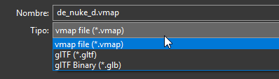

Aquí tienes el archivo `AI_coach_architecture.md` optimizado para ser utilizado como contexto principal ("System Context") en GitHub Copilot o cualquier asistente de programación.

Este documento consolida nuestra arquitectura híbrida, las definiciones de datos avanzadas que hemos diseñado y el análisis de brechas (Gap Analysis) entre lo que tienes actualmente en tus archivos y lo que necesitamos implementar.

---

````markdown
# AI Coach Architecture: CS2 Multi-Agent System

**Versión:** 2.0 (Post-Review)
**Contexto:** Desarrollo de un Coach de IA para Counter-Strike 2 utilizando Go para ETL (extracción y geometría) y Python/LLM para análisis y coaching.
**Objetivo:** Crear una arquitectura "Agent-Centric" donde los datos no se guardan por rondas, sino por dominio de conocimiento.

---

## 1. Arquitectura de Alto Nivel

El sistema sigue una filosofía **"Cerebro Izquierdo (Lógica) vs. Cerebro Derecho (Cognición)"**.

1.  **Capa de Ingesta (Go - `demoinfocs-golang`):**

    - **Rol:** ETL de alto rendimiento y Cálculo Geométrico.
    - **Responsabilidad:** Parsear `.dem`, calcular vectores (crosshair placement), mapear coordenadas a Callouts (NavMesh) y exportar JSONs estructurados.
    - **Input:** Archivo `.dem`.
    - **Output:** 5 JSONs temáticos (`metadata`, `economy`, `combat`, `grenades`, `tracking`).

2.  **Capa Analítica (Python - ML/Heurística):**

    - **Rol:** Especialistas de Dominio (Agentes).
    - **Modelos:**
      - _Economía:_ Reglas expertas + Risk Assessment.
      - _Aim:_ Detección de anomalías en series temporales.
      - _Posicionamiento:_ Clustering (K-Means) sobre datos de Pro-Players.
    - **Input:** JSONs temáticos.
    - **Output:** "Golden JSON" (Resumen ejecutivo de insights).

3.  **Capa Cognitiva (LLM - GPT-4o/Claude):**
    - **Rol:** Coach Empático y Comunicador.
    - **Responsabilidad:** Traducir el "Golden JSON" a lenguaje natural, priorizar errores y sugerir drills.

---

## 2. Especificación de Datos (JSON Schemas)

> **Nota para Copilot:** Los scripts de Go deben generar EXACTAMENTE estas estructuras. Los campos marcados con `[NUEVO]` son los que faltan en la implementación actual.

### A. `metadata.json` (Contexto Global)

Define las "reglas del juego" para la partida.

```json
{
  "match_id": "uuid_v4",
  "map_name": "de_mirage",
  "tick_rate": 64, // [NUEVO] Vital para convertir ticks a ms
  "map_crc": 12345678, // [NUEVO] Para validar versión del mapa
  "client_steam_id": "765...", // [NUEVO] ID del usuario principal (si aplica)
  "final_score": "13-11",
  "winner": "CT"
}
```
````

### B. `economy.json` (Agente Financiero)

Debe permitir calcular el riesgo ("Risk Management").
_Estado actual:_ Básico (solo valor de equipo).
_Objetivo:_ Añadir lógica de "Loss Bonus".

```json
[
  {
"match_id": "xxxxxxxxxxx",
  "rounds": [
    {
      "round": 1,
      "teams": {
        "CT": {
          "total_money": 4000,
          "loss_bonus": 1400,
          
        },
        "T": {
          "total_money": 4000,
          "loss_bonus": 1400,
        }
      },
      "players": [
        {
          "round_number": 1,
          "name": "Fr0sti Q('-'Q)",
          "team": "T",
          "spawn_area": "TSpawn",
          "buy_type": "Pistol Round",
          "initial_money": 800,
          "next_round_min_money": 1900,
          "start_round_items": [
            {
              "name": "Knife",
              "price": 0
            },
            {
              "name": "Glock-18",
              "price": 0
            },
            "equipment_value_start": 0,
          ],
          "spent_in_buy": 650,
          "purchases": [
            {
              "name": "Kevlar Vest",
              "price": 650
            }
          ],
          "final_money": 150,
          "equipment_value_survived": 0,
          "outcome": "loss",
          "win_reason": "BombExploded",
          "survived": false
        }
]
```

### C. `combat.json` (Agente Mecánico - Neutral)

Este es el archivo más complejo. **No existe "Enemigo", solo "Killer" y "Victim"**. Se registra el duelo bilateralmente.
_Estado actual:_ Lista de eventos plana.
_Objetivo:_ Duelos enriquecidos con métricas vectoriales.

```json
[
  {
  "duel_id": "uuid_gen_1",
    "tick": 2667,
    "map_area": "Mini",
    "winner_side": "CT",
    "killer": {
      "steam_id": 76561198441560875,
      "name": "Nocries 雨",
      "team": "CT",
      "weapon": "USP-S",
      "metrics": {
        "crosshair_placement_error": 0,
        "time_to_damage": 0,
        "velocity": 0,
        "is_blind": false
      }
    },
    "victim": {
      "steam_id": 76561199238397936,
      "name": "Bob Esponja",
      "team": "T",
      "weapon": "Desert Eagle",
      "metrics": {
        "crosshair_placement_error": 0,
        "time_to_damage": 0,
        "velocity": 0,
        "is_blind": false
      }
    },
    "context": {
      "distance": 19.16157341003418,
      "is_trade": false
    }
  }
]
```

### D. `grenades.json` (Agente de Utilidad)

Debe evaluar la calidad del lanzamiento, no solo el evento.
_Estado actual:_ Posiciones X/Y/Z simples.
_Objetivo:_ Añadir vectores de mirada para Lineups e impacto negativo.

```json
[
  {
    "type": "Flashbang",
    "thrower": "Bitarov",
    "tick_throw": 5000,
    "tick_explode": 13595,
    "thrower_area_name": "Outside",
    "land_area": "Mid Window",
    "start_position": {
      "x": 199.375,
      "y": -2115.59375,
      "z": -344.8125
    },
    "end_position": {
      "x": 1583.78125,
      "y": -1867.5,
      "z": -394.78125
    },
    "blinded_players": [
      {
        "name": "walimanqueadenuevo",
        "duration": 3.184789,
        "team": "T"
      },
      {
        "name": "๖ۣۜBossma๖ۣۜ",
        "duration": 4.215561,
        "team": "CT"
      }
    ],
    "enemies_blinded": 1,
    "allies_blinded": 1
  }
]
```

### E. `tracking.json` (Agente de Posicionamiento)

Sampling a baja frecuencia (\~2Hz / 500ms).
_Estado actual:_ Solo coordenadas X/Y/Z.
_Objetivo:_ Contexto de movimiento y estado del jugador.

```json
[
  {
    "tick": 1793,
    "round": 1,
    "player_steam_id": 76561197991999414,
    "pos": {
      "x": 2577.65576171875,
      "y": -501.815673828125,
      "z": -351.96875
    },
    "area_name": "CTSpawn",
    "view_yaw": 5.220566,
    "vel_len": 102.84502002786158,
    "is_walking": false,
    "is_ducking": false,
    "active_weapon": "Dual Berettas",
    "has_c4": false,
    "health": 100,
    "armor": 0,
    "nearby_teammates": 4,
    "is_alive": true
  }
]
```

---

## 3\. Estado del Proyecto (Gap Analysis)

Análisis basado en la inspección de los ficheros actuales (`combat.json`, `tracking.json`, etc.).

### ⚠️ Análisis de Ficheros Actuales

1.  **`tracking.json`:**

    - **Estado:** MEJOR DE LO ESPERADO.
    - _Lo que tienes:_ Ya incluye `velocity` (vector x,y,z), `view_angle` (pitch, yaw) y `active_weapon`.
    - _El Gap real:_
      - **Sampling:** Parece estar guardando _demasiados_ ticks. Necesitamos reducir la frecuencia a ~2Hz (cada 500ms) para no saturar.

2.  **`combat.json`:**

    - **Estado:** ESTRUCTURA CORRECTA, PERO FALTAN MÉTRICAS.
    - _Lo que tienes:_ Ya separas en objetos `killer` y `victim` con sus posiciones y ángulos. ¡Bien!
    - _El Gap real:_
      - **Matemáticas:** Falta calcular las algunas métricas correctamente. "crosshair_placement_error", "time_to_damage", "velocity", "is_blind" aparecen todos con valor "0" lo cual es incorrecto.

3.  **`economy.json`:**

    - **Estado:** INSUFICIENTE.
    - _Lo que tienes:_ Dinero gastado y equipamiento por jugador.
    - _El Gap real:_
      - La estructura es incorrecta.
      - No hay campo `next_round_min_money`.
      - Falta el resultado de la ronda en este archivo (`outcome`: Win/Loss).
      - El campo 'buy_type' debe estar en cada jugador y no en el equipo.

4.  **`grenades.json`:**
    - **Estado:** INSUFICIENTE.
    - _Lo que tienes:_ Granadas lanzadas y coordenadas.
    - _El Gap real:_
      - No hay campo `throw_view_vector`.
      - Falta el campo `land_area`. Esta en valor 0.
      - El campo 'throw_pos' aparece vacio.


---

## 4\. Notas Técnicas de Implementación para Copilot

### Cálculo de Crosshair Placement (Go)

3.2 Matemáticas para Crosshair Placement
Esta lógica debe ejecutarse en el momento exacto de un evento de interés (Duelo/Muerte).

Fórmula (Pseudo-Go):

Go

// 1. Obtener vectores
victimHeadPos := victim.Position() // + offset cabeza
playerEyePos := killer.Position() // + offset ojos
playerViewAngles := killer.ViewDirection() // Pitch/Yaw

// 2. Vector Ideal (Desde ojos a cabeza enemiga)
vecIdeal := (victimHeadPos - playerEyePos).Normalize()

// 3. Vector Real (Hacia donde mira el jugador)
vecReal := AnglesToVector(playerViewAngles)

// 4. Calcular Ángulo entre vectores
dotProduct := Dot(vecIdeal, vecReal)
// Clamp dotProduct entre -1 y 1 para evitar NaN
angleErrorRad := Acos(dotProduct)
angleErrorDeg := angleErrorRad \* (180 / PI)

// Resultado: Si angleErrorDeg > 10, es un mal pre-aim.

### Estructura de Ficheros de Salida

Mantener los archivos separados. No anidar todo en un solo JSON gigante.

- `exports/match_{ID}/economy.json`
- `exports/match_{ID}/combat.json`
- ...

### Muestreo de Tracking

No usar `parser.CurrentFrame()` para cada tick en `tracking.json`. Usar un ticker o módulo:

```go
if (tick % 64 == 0) { // Approx cada 0.5s en 128 tickrate
    // Snapshot state
}
```
