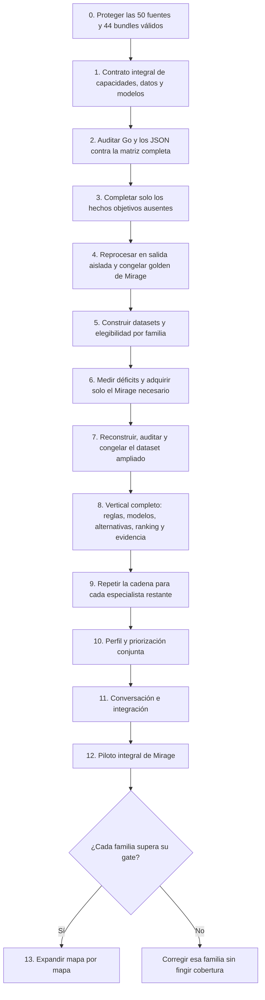

# Plan canónico de implementación del AI Coach

| Campo | Valor |
|---|---|
| Estado | Activo |
| Versión | 1.4 |
| Fecha | 27 de agosto de 2026 |
| Producto que implementa | [AI_COACH_PRODUCT_DEFINITION.md](./AI_COACH_PRODUCT_DEFINITION.md) |
| Equipo | Dos personas |
| Límite antes del piloto | 1.000 EUR de gasto externo acumulado |
| Primera entrega | Vertical técnico de Mirage para trade/spacing y peek/hold/reposición; el primer producto publicable será el coach integral de Mirage |

## Cómo mantener este plan

- Este documento contiene orden, tareas, gates y evidencias de implementación.
- `[x]` significa implementado y verificado en el código o corpus actual.
- `[ ]` significa pendiente; una implementación parcial continúa pendiente.
- No se inicia una fase de entrenamiento si el gate de datos anterior no ha pasado.
- No se descargan miles de demos para descubrir después que el contrato no permite reprocesarlas.
- Cada cambio de schema debe actualizar versión, manifest, golden corpus y dataset.
- Los resultados de experimentos se registrarán como artefactos reproducibles, no como afirmaciones en este documento.
- El catálogo de capacidades se diseña completo antes de entrenar; los especialistas se implementan y promueven por etapas.
- Objetivo contractual: una demo podrá ser elegible para una familia y no para otra. El flag actual `usable_for_training` sigue existiendo, pero no autoriza por sí solo todos los usos y deberá migrarse a elegibilidad por tarea.
- Cerrar una fase siempre obliga a actualizar aquí versión, estado, checks verificados, evidencias y una única siguiente acción, aunque no cambie el contrato del producto.
- El mismo cierre registra comandos y blockers, traslada el resultado al informe y al plan, elimina el prompt ejecutado y enlaza un único prompt vigente desde este plan y el README.

### Jerarquía documental

- [Definición de producto](AI_COACH_PRODUCT_DEFINITION.md): promesa, alcance y límites; sólo cambia si cambia una decisión real de producto.
- Este plan: única fuente para progreso, tareas pendientes, gates y siguiente acción.
- [Contrato humano](AI_COACH_CAPABILITY_AND_DATA_CONTRACT.md): significado de capacidades y datos.
- [Catálogo máquina](../ai_coach/contracts/capability_catalog.json): IDs y referencias consumibles por software.
- [Arquitectura de modelos](AI_COACH_MODEL_ARCHITECTURE.md): referencia técnica; no mantiene progreso.
- Auditorías fechadas y `docs/evidence/`: pruebas inmutables del estado observado.
- Las dependencias técnicas diagnosticadas en Gate 1A se conservan en la sección 19 de este plan, no en un backlog paralelo.
- `docs/prompts/`: contiene únicamente la siguiente instrucción ejecutable enlazada desde «Próxima acción concreta». Los prompts ejecutados se eliminan tras trasladar su resultado al informe y al plan.

---

## 1. Orden de ejecución



El camino crítico es:

1. catálogo integral de capacidades y límites observables;
2. contratos de decisiones, acciones, outcomes y abstención por familia;
3. matriz campo→procedencia→partición causal→cobertura→consumidor;
4. extractor factual común para demos FACEIT y demos de usuario;
5. elegibilidad y dataset causal verificables por tarea;
6. adquisición de Mirage guiada por déficits medidos, nunca por un contador aislado;
7. cadena completa por especialista: reglas, modelo si aporta valor, alternativas, ranking, evidencia y gate;
8. integración, personalización y conversación fundamentada;
9. promoción mapa por mapa.

Las dos familias actuales son el primer vertical técnico porque permiten comprobar la cadena con un coste controlado. No son la definición de terminado del producto.

El chat no debe adelantarse al motor de recomendación. Conversar es relativamente sencillo; fundamentar una corrección es la parte difícil.

---

## 2. Punto de partida verificado

Este inventario refleja el cierre reproducible del smoke de Mirage del 26 de agosto de 2026. Antes de una operación futura se volverá a comprobar en modo de solo lectura. Para mantenimiento mandan los manifests, hashes, contratos y release registrados, no un contador escrito en este documento.

### 2.1 Corpus local

| Medida | Estado verificado |
|---|---:|
| Demos fuente nuevas en `Faceit-Demos/demos/` | 50 |
| Mapa | Mirage |
| Bundles canónicos aprobados | 44 |
| Exclusiones seguras conservadas | 6 |
| Formato de los 44 bundles | `3.8.0` |
| `observed.jsonl.gz` | Presente en 44 de 44 |
| Decisiones causales | 36.181 |
| `spacing_or_trade_connection` | 26.648 |
| `peek_hold_or_reposition` | 9.533 |
| Release offline verificada | `stratai-2c6db440231d463a` |
| Staging | Vacío al cierre |
| Entrenamiento autorizado | No |

Las seis exclusiones no se fuerzan dentro del corpus: cuatro contienen identidad activa no reconciliable de bots y dos atribución no segura de la bomba. Permanecen disponibles para robustez y diagnóstico.

El inventario de cierre contiene 3.113 archivos y 40.853.375.267 bytes, aproximadamente 38,048 GiB, con digest global `1fdf935036ecb52e244b05c8246bdd046d1f40a1cc27720202185d9589850865`. La evidencia completa está en `../../Faceit-Demos/docs/MIRAGE_SMOKE_50_ACCEPTANCE_2026-08-26.md`.

Conclusiones:

- Las 44 partidas sirven para auditar contratos, reconstrucción, cobertura y reglas; no son un corpus suficiente para entrenar el coach integral.
- El lote es intencionadamente Mirage-only. La diversidad de mapas se añadirá después, con un gate independiente por mapa.
- El antiguo snapshot local de 296 bundles y `golden-demos-v2` se conserva únicamente como evidencia histórica. Sus fuentes se borraron de forma deliberada al reiniciar el corpus.
- No se buscarán las antiguas 51 fuentes salvo que el usuario indique expresamente que existe una copia que desea recuperar.
- Las fuentes actuales formarán el candidato a golden de Mirage. El contrato `3.8.0` todavía fija `golden-demos-v2` en lineage y validación; no se sustituirá su significado en silencio.
- Gate 1A debe diseñar una migración versionada de registro golden, lineage, validador, tests y release. Solo después podrá promoverse el golden de Mirage y añadirse un golden de transferencia por cada mapa posterior. Se decidirá expresamente si esa migración exige o no cambiar `3.8.0`.

### 2.2 Extractor Go

El export canónico actual contiene una base valiosa:

| Dominio | Fuente actual | Utilidad para el coach |
|---|---|---|
| Contexto | `core/match.json`, `participants.json`, `rounds.json` | Joins, mapa, equipos, lados, relojes y resultado |
| Combate | `events/combat_events.jsonl` | Disparos, daño, kills, arma, reload, switch, reacción y outcomes |
| Utilidad | `events/utility_events.jsonl` | Lanzamiento, trayectoria, lifecycle, flashes, daño y afectados |
| Objetivo | `events/objective_events.jsonl` | Plant, defuse, abortos, explosión y carrier |
| Estado táctico | `states/tactical/observed.jsonl.gz`, `oracle.jsonl.gz`, `gaps.jsonl.gz` | Base causal a 16 Hz con particiones físicas separadas; debe auditarse campo por campo |
| Estado descriptivo | `states/player_states/round_*.jsonl` | Posición y estado a 2 Hz; útil para agregados, insuficiente para timings finos |
| Replay | `presentation/replay/round_*.json.gz` | Proyección de interfaz a 16 Hz; no es la entrada causal del modelo |
| Engagements | `derived/engagements.json` | Outcomes de combate; inseguro como feature causal actual |
| Trades | `derived/trades.json` | Estadística preliminar; elegibilidad demasiado laxa |
| Economía | `economy_rounds.json`, `economy_players.json` | Buena base por ronda, aún no particionada causalmente |
| Mecánica | analyzers de mechanics, reaction y spray | Existe señal preliminar, pero falta contrato canónico completo por disparo |
| Calidad | manifests y `quality_report.json` | Hashes, schemas, gates fail-closed y publicación inmutable; falta elegibilidad por familia |

Referencias principales:

- [Modelos canónicos](../backend/go-service/models/canonical_models.go).
- [Modelos causales Block 7](../backend/go-service/models/block7_models.go).
- [Replay](../backend/go-service/handlers/replay.go).
- [Tracking a 2 Hz](../backend/go-service/handlers/tracking.go).
- [Construcción causal](../backend/go-service/parser/block7_causal.go).
- [Quality gates](../backend/go-service/parser/block7_quality.go).

### 2.3 Bloqueos actuales

La auditoría anterior permitió corregir fugas de futuro, separar `observed`, `oracle` y `outcomes`, endurecer tradeability y publicar el estado táctico a 16 Hz. Esos problemas permanecen como tests de regresión. Los bloqueos vigentes son:

1. No existe todavía un contrato integral que relacione todas las capacidades del coach con decisiones, acciones, campos, outcomes, modelos y abstenciones.
2. Las acciones causales actuales son demasiado pobres: peek se reduce principalmente a `peek`, `hold` o `engage`, y trade a `connected` o `disconnected`.
3. `peek_hold_or_reposition` no recibe exposición, LOS, orientación y distancias causales suficientes; los campos quedan correctamente `null/unavailable`.
4. FOV, bloqueo por humo, contactos observables y última posición conocida necesitan un contrato canónico completo antes de usarse como información disponible.
5. Counter-strafe, reacción, crosshair y spray tienen cálculos parciales, pero no un ledger canónico por disparo con disponibilidad y precisión verificadas.
6. Las conexiones del navmesh, rutas, reachability, tiempos de llegada, cobertura y zonas necesitan una auditoría común para peeks, rotaciones, crossfires y objetivos.
7. La validez del bundle todavía no se traduce en elegibilidad por familia. Un bundle válido puede servir para economía y no para exposición espacial.
8. No existe aún `ai_coach/`, constructor de datasets, calibración, modelos ni serving. La arquitectura ML está planificada, no implementada.
9. Falta un conjunto humano pequeño y versionado que mida decisiones, alternativas, desacuerdo y abstención por familia.

### 2.4 Descargador FACEIT

El descargador offline actual:

- toma los primeros jugadores de un ranking regional;
- usa `EU`, cinco jugadores y diez partidas por jugador como defaults;
- pide solamente `offset=0` del historial;
- deduplica por `match_id`;
- ordena candidatos por fecha reciente;
- filtra BO1 y disponibilidad de demo;
- limita el trabajo mediante `--max-demos`;
- descarga mediante la Downloads API y valida el bundle.

Referencias en `Faceit-Demos/faceit_downloader_api.py`:

- configuración: líneas 126-220;
- ranking e historial: líneas 496-530;
- deduplicación: líneas 1162-1204;
- selección: líneas 1219-1305;
- CLI: líneas 1788-1808.

Problemas para ML:

- sesgo hacia élite, EU y recencia;
- solapamiento entre historiales de top players;
- no hay selección longitudinal planificada;
- se descartan al publicar roster, skill, región, competición, resultado, seed y motivo de selección;
- no existen cuotas por skill, mapa o fecha;
- `--keep-demo` es falso por defecto;
- no se guarda un manifest de adquisición suficiente para reconstruir el muestreo.

La API oficial permite consultar historia con `from`, `to`, `offset` y `limit`, y el historial incluye roster y `skill_level`. El límite publicado por petición es 100. Véase la [Data API oficial de FACEIT](https://docs.faceit.com/api/data/). La descarga requiere un token con scope específico y una URL firmada mediante `POST /download/v2/demos/download`; véase la [Downloads API oficial](https://docs.faceit.com/getting-started/Guides/download-api/).

### 2.5 Veredicto de partida

No hay que reescribir el extractor ni añadir métricas al azar. Primero hay que cerrar el contrato integral y después comparar sus necesidades con los hechos canónicos existentes.

La decisión arquitectónica es:

1. Go extrae hechos objetivos, geometría y disponibilidad reproducibles.
2. Python agrupa esos hechos en decisiones, acciones, ventanas, outcomes y datasets por familia.
3. Reglas, modelos tabulares especialistas y situaciones similares estiman valor y soporte.
4. Un ranking común aplica incertidumbre, OOD, capacidad personal y abstención.
5. El LLM explica un Evidence Pack ya aprobado; no juzga la demo.

El corpus actual permite auditar y diseñar. No permite entrenar ni promover todavía un recomendador integral.

---

## 3. Organización para dos personas

### Persona A: datos y modelos

- sincronización y auditoría Go;
- adquisición FACEIT;
- manifests y dataset;
- reglas, modelos, calibración y ranking;
- evaluación cuantitativa.

### Persona B: producto y evidencia

- contratos de recomendaciones;
- servicio de inferencia;
- replay y Evidence Pack;
- interfaz y chat;
- piloto, feedback y evaluación cualitativa.

### Trabajo compartido

- definir acciones y outcomes;
- revisar muestras cada semana;
- aceptar o rechazar cada fase;
- mantener decisiones y presupuesto;
- evitar que una persona sea la única capaz de ejecutar el pipeline.

Cada fase debe incluir un comando reproducible, un artefacto inspeccionable y una revisión cruzada.

---

## 4. Fase 0 — Proteger el punto de partida actual

**Objetivo:** no perder las 50 fuentes, los 44 bundles válidos, las seis exclusiones ni su evidencia antes de fijar el contrato integral.

### Tareas

- [x] Pausar descargas masivas hasta cerrar contratos y gates.
- [x] Inventariar y hashear las 50 fuentes Mirage, los 44 bundles aprobados y las seis exclusiones.
- [x] Relacionar cada demo aprobada con su bundle, release y manifest.
- [x] Registrar mapa, schema, quality status, espacio y digest del lote.
- [ ] Marcar `golden-demos-v2` y el snapshot de 296 bundles como históricos, sin borrarlos ni convertirlos en gate activo.
- [ ] Definir el candidato a golden de Mirage a partir de las fuentes actuales y fixtures mínimos por capacidad.
- [ ] Diseñar la migración versionada desde la referencia obligatoria `golden-demos-v2`; no modificar lineage, validador ni release en esta fase documental.
- [ ] Comprobar permisos y uso previsto frente a los [términos de FACEIT Developer Tools](https://developers.faceit.com/terms).
- [ ] Confirmar que el token de Downloads API tiene el scope correcto sin registrar el secreto.
- [ ] Si falta acceso, solicitarlo en la primera semana: [FACEIT publica un plazo de respuesta esperado de 30 días](https://docs.faceit.com/getting-started/Guides/download-api/). La espera no bloquea el backfill de metadatos ni el trabajo Go, pero sí nuevas descargas.
- [ ] Definir retención: demo comprimida, bundle canónico, acquisition manifest y dataset derivado.
- [ ] Fijar límite de almacenamiento y alarma de capacidad.
- [ ] Crear una copia de seguridad del corpus actual si todavía no existe una copia verificada.

### Política de retención recomendada

- Conservar la demo en su compresión de origen mientras el schema esté en desarrollo.
- No conservar por duplicado demo comprimida y `.dem` descomprimida después de validar.
- Conservar indefinidamente manifests, hashes y bundles que formen parte de un dataset publicado.
- Permitir borrar derivados reproducibles antes que fuentes no recuperables.
- No almacenar credenciales o URLs firmadas en manifests.

### Gate 0

- Las 50 fuentes, 44 aprobaciones y seis exclusiones conservan hash, estado y lineage.
- Sabemos qué bundles se pueden reprocesar y con qué release.
- Existe espacio para el siguiente lote y una política de parada.
- El uso de API y demos ha sido revisado.
- El corpus histórico no bloquea el gate Mirage-first y no se intenta reconstruir sin una decisión explícita del usuario.

Las tareas pendientes de Gate 0 bloquean descargas, reprocesados y mutaciones del corpus. No bloquearon la auditoría documental y de solo lectura ya cerrada en Gate 1A, ni bloquean el siguiente constructor read-only de ejemplos.

---

## 5. Fase 1 — Contrato integral y base factual Go

**Objetivo:** definir primero todo lo que el coach debe valorar y después producir los hechos necesarios sin fuga, separados en observed, oracle y outcomes.

### 5.0 Contrato integral antes de cambiar el extractor

La fase documental y de auditoría, cerrada el 27 de agosto de 2026, creó:

- `docs/AI_COACH_CAPABILITY_AND_DATA_CONTRACT.md`, fuente humana de verdad;
- `ai_coach/contracts/capability_catalog.json`, matriz legible por máquinas y validada por referencias;
- contratos versionados de decisiones, acciones, outcomes, features, elegibilidad y recomendaciones;
- una arquitectura de modelos especialistas y un backlog de carencias ordenado.

El catálogo cubre como mínimo:

1. combate y mecánica observable;
2. peeks, duelos, cobertura y exposición;
3. spacing, apoyo, trades, crossfires e impacto de entry;
4. utilidad;
5. economía;
6. información disponible;
7. rotaciones y control del mapa;
8. bomba, postplant, retake, save y tiempo;
9. ventaja, riesgo y clutch;
10. evolución personal como capa transversal.

El contrato no tratará todas estas áreas como el mismo tipo de modelo:

- **proveedores de hechos:** observabilidad, geometría, información y relojes;
- **especialistas prescriptivos:** trade, peek, combate/mecánica, utilidad, economía, rotación y objetivo;
- **evaluadores transversales:** ventaja, riesgo, tiempo y clutch;
- **perfil longitudinal:** patrones construidos con historia anterior;
- **explicador:** LLM limitado al Evidence Pack.

CatBoost será candidato para cada especialista prescriptivo que necesite aprendizaje, no una obligación para toda capa. Una regla simple puede ser la solución promovida si gana el benchmark.

Cada capacidad debe declarar de forma concreta:

- actor, inicio, `T0`, final y ventanas temporales;
- acción observada y alternativas comparables;
- campos `observed` permitidos;
- campos `oracle` permitidos solo para labels o evaluación;
- outcomes y factores de confusión;
- procedencia, unidad, frecuencia, nulabilidad y cobertura;
- elegibilidad, exclusiones, OOD, confianza y abstención;
- regla o modelo inicial, métrica y test de promoción;
- fixtures positivos, negativos y `unavailable`;
- si añadir el dato obliga a reprocesar la demo.

Cada dato se clasificará como `EXISTE_VERIFICADO`, `DERIVABLE`, `PARCIAL`, `FALTA_EXTRAER`, `REQUIERE_CLASIFICACION`, `NO_OBSERVABLE` o `DESCONOCIDO`. Que un campo exista no demuestra que sea correcto o útil.

Se definirán dos consumidores del mismo extractor:

- **FACEIT:** dataset offline sin jugador focal obligatorio;
- **usuario:** inferencia sobre un Steam ID reconciliado y perfil construido solo con historia anterior.

Las demos del usuario solo podrán alimentar un entrenamiento global posterior con consentimiento, anonimización, calidad, versionado y retirada.

### Gate 1A — Contrato integral

- Todas las familias del producto están representadas.
- Cada decisión tiene acciones, datos, outcomes, límites y modelo inicial.
- Todo campo requerido tiene procedencia y estado; las incógnitas permanecen explícitas.
- `observed`, `oracle`, `outcomes` y perfil histórico están separados.
- Existe elegibilidad por tarea, no un permiso global de entrenamiento.
- El contrato distingue dato que falta en Go, derivación de Python, clasificación espacial y dato imposible de conocer.
- Existe un plan versionado para migrar la referencia obligatoria `golden-demos-v2` sin alterar silenciosamente el lineage de `3.8.0`.
- No se ha entrenado, descargado ni reprocesado nada para cerrar este gate.

### Estado verificado de Gate 1A — 27 de agosto de 2026

Gate 1A documental queda **cerrado** por [el contrato humano](AI_COACH_CAPABILITY_AND_DATA_CONTRACT.md), [el catálogo máquina](../ai_coach/contracts/capability_catalog.json), [la arquitectura](AI_COACH_MODEL_ARCHITECTURE.md) y [la auditoría cuantitativa](AI_COACH_MIRAGE_44_DATA_AUDIT_2026-08-27.md). El validador comprueba 17 capacidades, 15 decisiones, 51 acciones, 18 outcomes y 55 campos sin IDs duplicados ni referencias rotas. Esto cierra el contrato, no Gate 1B ni el permiso de entrenamiento.

La auditoría obliga a adelantar cuatro dependencias: `enemy_los` es sólo un proxy geométrico sin FOV/smoke demostrado; ammo/reserve/reload están no disponibles en la muestra tactical observed; la velocidad inicial del proyectil no existe en los 14.759 eventos de utilidad; y mesh/nav/raycast no entregan clasificación táctica, reachability, ruta ni ETA. Ninguna familia afectada puede saltarse esos blockers.

### 5.1 Una sola fuente de verdad Go

- [x] Comparar las dos copias actuales con hashes y tests.
- [x] Portar a StratAI los filtros/endurecimientos presentes solo en Faceit-Demos.
- [x] Declarar `StratAI/backend/go-service` como fuente canónica.
- [x] Publicar desde StratAI un binario offline versionado con commit, schemas y checksum; release verificada `stratai-2c6db440231d463a`.
- [x] Hacer que Faceit-Demos invoque la release local inmutable mediante `STRATAI_GO_RELEASE_DIR`/`CURRENT` y valide su identidad.
- [ ] Marcar la copia Go de Faceit-Demos como transitoria y retirarla cuando la integración sea estable.
- [x] Fallar si versión, schema o provenance no coinciden.
- [ ] Ejecutar fixtures de integración desde el descargador y comparar sus hashes con la release canónica.

No se usarán symlinks ni copias manuales de fuente entre repositorios. Faceit-Demos consumirá una release local e inmutable del parser; no dependerá de que el servicio web de StratAI esté levantado.

### 5.2 Corregir causalidad

- [x] Construir decisiones desde roster/actor conocidos en `T0`, no desde participantes futuros.
- [x] Añadir `decision_id`, `actor_player_id`, `t0_tick`, `decision_type` y `action_taken`.
- [x] Marcar `actor_player_id` como clave de join no entrenable.
- [x] Separar `observed_state`, `oracle_state` y `outcomes` físicamente.
- [x] Añadir `availability_tick`, `status`, `source`, `causal_role` y `visibility_scope` donde corresponda.
- [x] Crear test de invariancia: mutar eventos posteriores a `T0` no modifica las features y sí puede modificar outcomes.
- [x] Prohibir `match_id`, SteamID y outcomes como features del modelo mediante allowlists fail-closed.

### 5.3 Promover el estado táctico de 16 Hz

- [x] Crear artefactos canónicos observed/oracle/gaps a 16 Hz a partir del replay.
- [ ] Usar IDs pseudónimos, no nombres.
- [ ] Publicar posición, vista, velocidad, vida, armadura, arma, ammo, dinero, kit, C4, walking, ducking, scoped, blind y reload.
- [ ] Publicar smokes, infernos, proyectiles, bomba, clocks y fase objetiva.
- [x] Añadir disponibilidad y procedencia.
- [x] Mantener el replay de UI como proyección separada.
- [x] Versionar los nuevos schemas tácticos.

### 5.4 Observabilidad

- [ ] Publicar contacto visual causal: inicio, fin, jugador observado y observador.
- [ ] Publicar última posición conocida y edad de la observación.
- [ ] Incorporar FOV, raycast, humo y disponibilidad de geometría.
- [x] Devolver `unavailable` cuando falte geometría; nunca “cero enemigos” por ausencia del mapa.
- [x] Mantener el estado real enemigo exclusivamente en oracle.

El sonido subjetivamente percibido queda fuera de la primera versión integral. No se inferirá audibilidad desde velocidad sin un contrato acústico.

### 5.5 Tradeability y rutas

- [x] Redefinir compañero elegible mediante distancia, LOS, tiempo y orientación.
- [x] Separar `teammate_alive`, `trade_possible` y `trade_completed`.
- [x] Para el vertical técnico, abstenerse cuando distancia directa y geometría no basten para validar la conexión.
- [ ] Para el coach integral, conservar conexiones del navmesh y calcular path distance, reachability y tiempo aproximado de llegada.
- [x] Publicar motivos de abstención cuando el mapa no permita la evaluación.

### 5.6 Ejecución

- [ ] Para el vertical técnico, publicar eventos mínimos enlazados por `shot_id`: tick, actor, arma, velocidad, blind/smoke y disponibilidad.
- [x] Distinguir cero observado de valor no disponible en los contratos causal, táctico y de tradeability.
- [ ] Separar estado en el disparo del resultado posterior del disparo.
- [ ] Para el especialista de mecánica del coach integral, añadir counter-strafe, reacción, crosshair y spray con su contrato y gate propios.

### 5.7 Quality gates reales

- [x] Exigir el conjunto completo de artefactos.
- [x] Recontar JSON/JSONL y validar schema embebido.
- [x] Validar formato, compresión, orden y hashes.
- [ ] Calcular de verdad future leakage, causal availability, schema compatibility, determinism y corpus quality.
- [x] Publicar en staging y exigir un commit marker inequívoco antes de considerar visible un bundle.
- [x] Permitir reintento seguro tras fallo.

### 5.8 Matriz inicial de preparación integral

Esta tabla era el resumen de partida. Gate 1A ya la convirtió en la matriz campo por campo del contrato v1 y demostró su cobertura con la auditoría Mirage 44; se conserva aquí como resumen operativo.

| Familia | Estado actual | Mínimo para construir dataset | Prueba negativa o `unavailable` |
|---|---|---|---|
| Spacing, apoyo y trade | Parcial avanzado | Estado en `T0`, LOS, distancia, tiempo, orientación y ruta cuando sea necesaria | Compañero muerto, lejano, bloqueado o sin tiempo no cuenta como tradeable |
| Peek, hold, cobertura y exposición | Insuficiente | FOV, LOS, humo, ángulos, orientación, cobertura, salida y separación de oracle | Pared, humo o geometría ausente nunca se convierten en «cero peligro» |
| Combate y mecánica | Parcial | Ledger por disparo, movimiento, arma, mira, reacción y precisión declarada | Valor desconocido no equivale a jugador parado ni a reacción cero |
| Entrada y coordinación | Parcial | Acción, timing aliado, utilidad observable, conexión y outcomes 2/5/10 s | Kill sin soporte no convierte automáticamente la decisión en correcta |
| Utilidad | Consecuencias fuertes; decisión pendiente | Inventario en `T0`, throw→trayectoria→efecto→continuación y alternativas válidas | Granada ausente o intención desconocida no genera una recomendación falsa |
| Economía | Fuerte por ronda; valor multirronda pendiente | Freeze snapshot, compras, inventario de equipo y outcomes de 1-3 rondas | Warmup, dinero inconsistente o reglas especiales producen exclusión |
| Información disponible | Parcial | Contactos causales, última posición conocida, edad, objetivo y disponibilidad | Enemigo solo oracle nunca aparece como información del jugador |
| Rotación y control del mapa | Insuficiente | Zonas, conexiones NAV, rutas, reachability, tiempos y control observable | Ruta inexistente o asset ausente obliga a abstenerse |
| Bomba, postplant, retake y save | Eventos fuertes; decisiones pendientes | Ledger objetivo, clocks, kit, rutas, utilidad, posiciones y deadlines | Secuencia o actor no reconciliable no se usa para recomendar |
| Ventaja, riesgo y clutch | Derivable después de las anteriores | Estado causal, valor local, objetivo, economía e incertidumbre | Ganar la ronda no etiqueta por sí solo una mala acción como buena |
| Perfil longitudinal | Insuficiente en el smoke | Identidad pseudónima estable, orden temporal, contexto y soporte mínimo | El perfil nunca usa partidas futuras ni afirma hábito con pocas muestras |

### Gate 1B — Base factual y causal

No se entrena el recomendador hasta cumplir:

- features idénticas al mutar eventos futuros;
- ninguna feature observed lee oracle u outcomes;
- stream de 16 Hz sin gaps silenciosos;
- ausencias representadas como `null/unavailable`;
- joins decisión→actor→estado→acción→outcome completos;
- fallo del validador ante artefacto ausente, conteo falso o schema incorrecto;
- hashes deterministas con distinto paralelismo;
- candidato golden de Mirage basado en las fuentes actuales y fixtures por capacidad aprobado;
- migración versionada de lineage/validador/tests/release completada antes de llamarlo golden activo;
- elegibilidad calculada y explicada por familia;
- ningún campo se declara disponible solo porque exista en el JSON.

### Estado verificado de Gate 1B — 26 de agosto de 2026

Gate 1B permanece **pendiente**. El working tree contiene y prueba los contratos de decisiones, las particiones físicas observed/oracle/outcomes, la invariancia de features ante una mutación posterior a `T0`, el stream táctico 16 Hz con gaps explícitos, tradeability física con abstención y los validadores negativos de artefactos/publicación.

El smoke reproducible de Mirage queda cerrado con 50 demos originales, 44 bundles aprobados y 6 exclusiones seguras. Las 44 aprobadas usan el contrato 3.8.0, conservan `observed.jsonl.gz` y pasaron auditorías independientes de combate, engagements y las cinco particiones causales. Hay 36.181 decisiones: 26.648 `spacing_or_trade_connection` y 9.533 `peek_hold_or_reposition`, ambas presentes en las 44 partidas.

La revisión determinista de 100 decisiones por familia cubre en conjunto las 44 partidas. `spacing_or_trade_connection` conserva distancia, tiempo, LOS, orientación y tradeability como derivados explícitos. En cambio, las 9.533 decisiones de `peek_hold_or_reposition` carecen de exposición, LOS, orientación y distancias causales; esos campos permanecen correctamente en `null/unavailable`, pero la familia aún no es suficiente para una recomendación prescriptiva. Falta además una firma humana de dominio.

`golden-demos-v2` documenta un corpus diverso anterior cuyas fuentes se borraron de forma intencionada al comenzar la descarga limpia de Mirage. Operativamente no se intentará reconstruir salvo decisión expresa del usuario. Sin embargo, el contrato `3.8.0` todavía exige ese identificador en lineage y validación: seguirá vigente hasta que una migración contractual versionada permita promover el candidato Mirage sin engañar al validador.

Siguen bloqueando Gate 1B:

1. convertir el lote actual en candidato golden de Mirage y ejecutar, sólo tras autorización, la migración contractual de lineage, validador, tests y release hacia una ubicación nueva;
2. integrar FOV/smoke/contact age en observed y completar la evidencia espacial causal de `peek_hold_or_reposition` sin leer oracle ni futuro;
3. materializar ammo/reserve/reload a 16 Hz, normalizar sentinels de arma y resolver el contrato de velocidad inicial de utilidad;
4. clasificar zonas/sites/chokes/cover/exposure/exits y producir reachability, route/path distance y ETA versionados;
5. construir `DecisionExample`/`TaskEligibility` read-only y obtener revisión humana registrada, primero para las dos familias del vertical y después para cada especialista.

El cierre detallado y sus hashes están en `../../Faceit-Demos/docs/MIRAGE_SMOKE_50_ACCEPTANCE_2026-08-26.md`. `training_allowed` sigue siendo `false`.

---

## 6. Fase 2 — Estrategia de corpus FACEIT

**Objetivo:** obtener diversidad para aprender valor, referencias de alto nivel y suficientes secuencias por jugador para personalizar.

### 6.1 Respuesta a qué partidas descargar

No se debe elegir una sola de estas opciones:

| Estrategia única | Problema |
|---|---|
| Solo nivel 10 | Aprende contextos y mecánicas poco representativos para usuarios normales; no modela progresión |
| Solo partidas del mismo jugador | Personaliza, pero carece de alternativas y baselines para saber qué era mejor |
| Partidas aleatorias de todos los niveles | Aporta diversidad, pero puede aprender hábitos débiles y quedar dominada por mapas/cohortes frecuentes |
| Solo top ranking reciente | Introduce sesgo élite, regional, temporal y de red social |

La solución es un corpus mixto con cuatro funciones.

### 6.2 Cuatro subconjuntos

#### A. Corpus general de dinámica y valor

- Todos los niveles relevantes.
- Partidas completas, no solo victorias.
- Sirve para aprender qué ocurre después de estado+acción.
- El skill band forma parte del contexto, no de la identidad.

#### B. Corpus de referencia experta

- Nivel 10 y high Elo.
- Sirve para recuperar alternativas de alta calidad y construir priors.
- No se utiliza como única verdad ni se recomienda una acción profesional si no es ejecutable para el usuario.

#### C. Panel longitudinal

- Muchas partidas de los mismos jugadores.
- Sirve para recurrencia, tendencias y adaptación personal.
- Debe cubrir varios niveles, no solo élite.

#### D. Corpus de evaluación

- Jugadores, partidas y fechas no usados en entrenamiento.
- Incluye casos revisados por humanos.
- Nunca se usa para decidir features o thresholds después de mirar resultados.

### 6.2.1 Separación FACEIT y usuario

- Las demos FACEIT alimentan la factoría offline de datasets globales y no tienen jugador focal obligatorio.
- Las demos del usuario usan el mismo extractor, pero identifican su Steam ID para inferencia y perfil.
- Los modelos globales no se actualizan durante el análisis de una partida del usuario.
- El perfil personal puede actualizarse inmediatamente con historia válida del propio usuario.
- La entrada posterior de demos de usuario en un corpus global requiere consentimiento, pseudonimización, quality gates, dataset versionado y mecanismo de retirada.

### 6.3 Volumen inicial recomendado

No descargar todo de una vez. Usar gates:

| Lote | Tamaño acumulado | Propósito |
|---|---:|---|
| Smoke cerrado | 50 fuentes / 44 bundles válidos | Validar schema, retención, calidad y cobertura inicial |
| Auditoría contractual | Las 44 válidas | Medir qué sirve para cada familia; no entrenar |
| Golden humano | 100-200 decisiones iniciales por familia priorizada | Validar semántica, alternativas y abstención |
| Primer lote de modelado | Orientación inicial de 300 Mirage elegibles | Solo después de Gates 1A, 1B y 3; el número no garantiza suficiencia |
| Expansión condicionada | Lotes de hasta 100 | Cubrir el déficit medido de cada familia, acción, cohorte o outcome |
| Transferencia | Se decide mapa por mapa | Solo después de validar el coach integral de Mirage |

Los 44 bundles actuales no cuentan automáticamente para todas las familias. Cada partida tendrá `eligible[task]`; por ejemplo, puede servir para economía aunque no tenga geometría suficiente para exposición. El futuro plan de adquisición calculará el déficit por familia y soporte de acciones, no solo `300 - total_de_partidas`.

El cierre actual ocupa aproximadamente 38,048 GiB entre fuentes, bundles y evidencias inventariadas. Antes de cualquier lote se medirá de nuevo el tamaño medio real y se reservará espacio para fuentes, staging, bundles, derivados y rollback.

### 6.3.1 Unidades de muestreo

Para que una partida repetida entre seeds no infle las cuotas:

- **almacenamiento:** `match_id` únicos y causalmente elegibles; 300 es una primera orientación que el contrato de cobertura puede aumentar, reducir o repartir por tarea;
- **adquisición:** cada match recibe un `primary_focal_player` determinista y una única banda primaria para las cuotas porcentuales;
- **cohortes secundarias:** otros seeds, panel longitudinal o referencia experta se guardan como tags superpuestos, sin volver a contar la demo;
- **entrenamiento:** la unidad es la ventana actor-decisión; su distribución por skill se informa aparte y no se confunde con la distribución de matches.

Objetivo orientativo por skill del `primary_focal_player`:

| Banda FACEIT | Cuota orientativa | Uso |
|---|---:|---|
| 1-3 | 15 % | Patrones de iniciación y calibración baja |
| 4-6 | 30 % | Usuarios intermedios |
| 7-8 | 25 % | Usuarios avanzados |
| 9-10 | 30 % | Referencia experta y high-skill |

Estas cuotas son mutuamente excluyentes a nivel de adquisición, no una verdad permanente. Deben ajustarse al público real del producto. Se registrará también la distribución de los diez participantes y de las ventanas actor-decisión, no solo el focal.

Panel longitudinal inicial:

- seis jugadores focales como mínimo, repartidos entre bandas;
- objetivo de 15 partidas por jugador;
- las partidas pueden solaparse con el corpus general;
- deduplicación física por `match_id`;
- el manifest conserva todas las pertenencias a cohortes.

Si una expansión posterior alcanza aproximadamente 600 partidas elegibles, el objetivo orientativo sube a 12 jugadores focales y 20 partidas por jugador.

Referencia experta inicial:

- si el primer plan se fija en 300, al menos 75 partidas de referencia experta;
- actor nivel 9-10, lobby de mediana al menos 9 y dispersión baja;
- Elo capturado en el momento de adquisición cuando la fuente lo permita;
- variedad por mapa, lado, marcador y economía;
- no seleccionar únicamente ganadores o partidas con alto K/D.

Si la expansión alcanza aproximadamente 600, la referencia experta sube como mínimo a 150 partidas.

Cuota por mapa causalmente elegible para el primer gate:

- al menos 250 partidas de Mirage para el primer recomendador;
- las restantes cubren diversidad y casos de robustez del parser;
- el primer modelo que publica «mejor acción» se entrena y valida solo en Mirage.

Después del Gate 9B se elegirá el siguiente mapa y se fijará su cuota según geometría, cobertura y familias. No se mezclarán automáticamente Dust2 o Ancient en el entrenamiento de Mirage solo por alcanzar un contador global.

### 6.4 Cuotas adicionales

- La excepción inicial de Mirage es intencional para reducir geometría, espacio de acciones y QA.
- En la expansión general, ningún mapa debería superar el 25 % sin una razón documentada.
- Cada mapa debe tener su propio mínimo y evaluación antes de publicar recomendaciones específicas.
- Registrar pool y versión de mapa; no mezclar silenciosamente revisiones.
- Recopilar mediante intervalos explícitos de fecha.
- Comenzar en una región para reducir variabilidad y añadir regiones como cohortes versionadas.
- Conservar overtime como flag; no mezclarlo con regulación sin contexto.
- Mantener casos con desconexiones, bots o demos truncadas en un corpus de robustez, no en train principal.

### 6.5 Criterios de inclusión del train principal

- CS2 5v5 estándar.
- Partida finalizada.
- Demo disponible y checksum válido.
- Diez participantes reconciliables al comenzar, con excepciones explícitas.
- BO1 durante el primer corpus Mirage.
- Mapa y assets soportados.
- Schema y hard gates aprobados.
- Metadatos de adquisición completos.
- Patch/cohorte identificables.

### 6.6 Criterios de cuarentena

- forfeit o partida extremadamente corta;
- corrupción/truncación;
- sustitución, bot o desconexión prolongada;
- reglas de hub o torneo no compatibles;
- mapa sin geometría requerida;
- roster o skill no reconciliable;
- schema antiguo no reprocesable;
- quality warning que afecta la tarea concreta.

No se borran automáticamente. Se etiquetan para robustez o revisión.

### 6.7 Cambios del descargador

- [ ] Añadir `--plan corpus_plan.yaml` y un hash del plan.
- [ ] Añadir `--seed-file players.csv` y `--match-id-file`.
- [ ] Añadir `--metadata-only`, `--dry-run` y `--resume`.
- [ ] Paginar historiales con `offset` y `limit`.
- [ ] Añadir `--from` y `--to` explícitos.
- [ ] Añadir cuotas por banda, mapa, fecha y máximo por jugador.
- [ ] Filtrar modo, estado, roster, región y reglas de competición.
- [ ] Capturar detalles completos antes de reducirlos a `SelectedDemo`.
- [ ] Conservar demo comprimida por defecto durante I+D.
- [ ] Añadir `corpus.sqlite` para estado durable, cuotas, intentos y reanudación.
- [ ] Registrar errores y motivos de descarte de forma agregable.
- [ ] Limitar bytes, demos, workers y tiempo por ejecución.
- [ ] Liberar la reserva de checksum también después de un fallo.

No se añadirá Redis ni BullMQ a la factoría offline. SQLite y workers locales acotados son suficientes para dos personas y una máquina.

Estados mínimos de adquisición:

```text
discovered
metadata_ready
selected
downloaded
parsed
validated
rejected
retryable_failed
permanent_failed
```

### 6.8 Acquisition manifest

Cada match debe conservar, sin secretos:

```text
acquisition_schema
match_id
source
selected_at
metadata_queried_at
metadata_sha256
finished_at
region
game_mode
match_type
competition_id / competition_type
best_of
status
map
result
roster[]:
  faceit_player_id_pseudonymous
  steam_id_pseudonymous
  team
  skill_level_at_history
  elo_if_available
seed_players[]
primary_focal_player
primary_skill_band
selection_cohorts[]
selection_reason
history_query_from / to / offset
resource_checksum
demo_checksum
parser_version
canonical_schema
quality_status
```

No se guardan API keys, access tokens ni signed URLs.

El skill/Elo se almacena como valor devuelto por el endpoint y con su `metadata_queried_at`; no se afirmará que representa el valor histórico exacto de la fecha del match sin verificar esa semántica en el contrato de la fuente.

### 6.9 Sesgo y uso por modelo

- El modelo de dinámica puede usar todas las bandas con skill como contexto.
- La biblioteca de alternativas prioriza la misma banda y bandas superiores.
- Los casos nivel 10 actúan como referencia aspiracional, no como acción automáticamente óptima.
- El modelo de personalización usa únicamente el pasado del jugador.
- La evaluación se publica por banda; una media global no es suficiente.

### Gate 2

- El planificador alcanza cuotas sin descargar.
- Dos ejecuciones del mismo plan producen la misma selección.
- Los matches duplicados conservan varias cohortes pero una sola demo.
- Cada demo tiene acquisition manifest y checksum.
- Se puede reconstruir por qué fue elegida.
- El inventario y metadata de las 50 fuentes actuales informa la distribución real antes de adquirir nuevas.
- El smoke limpio de 50 ya está cerrado y se usa como evidencia de entrada, no como autorización de entrenamiento.
- No se adquiere ningún lote nuevo hasta superar Gates 1A, 1B y 3 y conocer el déficit por familia.

---

## 7. Fase 3 — Constructor del dataset causal

**Objetivo:** convertir artefactos canónicos en ventanas reproducibles de decisión, sin etiquetar manualmente bueno/malo.

Aquí «causal» significa temporalmente legal y libre de fuga posterior a `T0`. No demuestra por sí solo el efecto de intervenir con una acción alternativa. Los modelos observacionales estiman valor condicional y deben declarar su base de comparación, soporte, overlap e incertidumbre.

### 7.1 Responsabilidad

Go publica observaciones y eventos. Python:

- detecta candidatos de decisión;
- crea ventanas;
- abstrae acciones;
- construye outcomes;
- genera candidatos;
- calcula features tabulares;
- divide datasets.

No se incorporará lógica de entrenamiento a rutas FastAPI ni al extractor Go.

### 7.2 Tipos de decisión por entrega

El catálogo completo se congela antes de implementar los datasets. El orden de construcción es:

Vertical técnico:

1. `spacing_or_trade_connection`;
2. `peek_hold_or_reposition`, incluyendo la decisión inmediatamente posterior al contacto.

Especialistas del coach integral de Mirage:

3. `duel_take_avoid_or_delay`;
4. `shoot_stop_reset_or_reload` y diagnósticos de ejecución enlazados;
5. `utility_use_delay_coordinate_or_save`;
6. `buy_partial_eco_drop_or_save`;
7. `hold_take_or_cede_map_control`;
8. `rotate_delay_cancel_or_regroup`;
9. `respond_hold_reposition_or_rotate_on_information`;
10. `plant_delay_or_protect`;
11. `retake_defuse_or_save`;
12. `preserve_advantage_or_take_risk`;
13. decisiones condicionadas de clutch cuando exista soporte.

El perfil longitudinal no es una acción: consume las decisiones anteriores usando únicamente el pasado del jugador.

Sonido subjetivo, voz, intención y entrada exacta de teclado/ratón se marcan `NO_OBSERVABLE` mientras no exista un contrato fiable. Una familia no se activa por existir en el schema: necesita cobertura, candidatas, test negativo, revisión humana y gate propios.

### 7.3 Ventana

Cada ejemplo contendrá:

```text
history:       T0 - 10 s hasta T0
action_label:  T0 hasta T0 + 0,25/2 s según tipo
short_outcome: T0 + 2 s
mid_outcome:   T0 + 5/10 s
round_outcome: fin de ronda
economy:       una a tres rondas posteriores
match_outcome: final de partido
```

La entrada de estado solo utiliza history y estado en `T0`. `action_label` observa un tramo posterior únicamente para identificar y parametrizar la acción que el jugador realizó; ninguno de sus eventos se convierte en feature de estado. Los horizontes restantes son outcomes o evidencia posterior.

Durante entrenamiento, el valor recibe `estado_en_T0 + acción_observada_abstraída`. Durante inferencia recibe `estado_en_T0 + action_candidate` generada desde información legal. Los parámetros de una candidata se calculan sin copiar hechos futuros de la acción observada. Las pruebas deben verificar por separado invariancia del estado en `T0`, etiquetado de acción y outcomes.

### 7.4 Contrato de ejemplo

```text
dataset_version
example_id
match_id_join_only
round_id
actor_id_join_only
t0_tick
decision_type
observed_state_ref
belief_state_ref
oracle_state_ref_teacher_only
action_taken
candidate_actions[]
candidate_action_parameters[]
outcomes_by_horizon
execution_outcomes
availability_mask
support_metadata
support_by_action
effective_sample_size
lineage
split
```

### 7.5 Acciones

- Detectar acciones desde transiciones observables, no desde labels bueno/malo.
- Mantener una taxonomía pequeña versionada.
- Parametrizar zona, objetivo y timing.
- Conservar acción cruda y acción abstraída.
- Registrar por qué una candidata es válida o inválida.

### 7.6 Outcomes automáticos

- supervivencia;
- daño y kill;
- trade posible/completado;
- cambio de exposición;
- ocupación y avance aliado;
- plant/defuse;
- equipo vivo;
- inventario conservado;
- resultado de ronda;
- economía posterior;
- resultado de partido.

No son por sí solos una definición de acción correcta. Alimentan el modelo de valor y deben analizarse a varios horizontes.

### 7.7 Splits

- Mantener todas las ventanas de un `match_id` en el mismo split.
- Test posterior en el tiempo.
- Holdout por jugador focal para medir generalización; informar por separado el solapamiento de compañeros y rivales.
- Holdout longitudinal: el perfil solo ve el pasado del jugador y se evalúa en sus partidas posteriores.
- Medir el tamaño de componentes conectados como diagnóstico, sin exigir una partición imposible si la red FACEIT forma un componente gigante.
- Agrupar y ponderar ventanas solapadas del mismo episodio para que no aparenten decisiones independientes.
- Normalizar o limitar el peso por partida para que una demo larga no domine el entrenamiento.
- Publicar slices por mapa, banda, lado, arma, decisión y disponibilidad.
- Publicar número efectivo de partidas, jugadores, episodios y acciones, no solo filas.
- No calcular normalizadores con validación o test.
- IDs se usan para joins y splits, nunca como features.

### 7.8 Formato

- Parquet particionado para ventanas y features.
- DuckDB para consultas y auditorías locales.
- JSON pequeño únicamente para contracts, manifests y fixtures.
- Dataset manifest con hashes, schemas, filtros, cuotas y código.

### Gate 3

- 100 % de ejemplos tienen lineage.
- El test de futuro pasa.
- Las distribuciones antes/después de filtros están documentadas.
- Duplicados exactos y casi duplicados están controlados.
- Se pueden reconstruir 100 ejemplos del vertical y una muestra acordada de cada nueva familia desde la demo.
- Ninguna feature prohibida aparece en la matriz final.
- Una fila no aparece en un dataset si su `task_eligibility` no autoriza esa familia.
- Solo después de pasar estas pruebas se adquiere en lotes de hasta 100 para cubrir el plan de corpus aprobado.
- Cada lote se reconstruye y audita antes de autorizar el siguiente; no se salta de 300 a 600 o 1.000 por inercia.

---

## 8. Fase 4 — Reglas y benchmark mínimo

**Objetivo:** conseguir valor de producto y una referencia antes de entrenar ML.

### Reglas iniciales

- distancia/tiempo de conexión al trade;
- doble exposición verificable;
- repetición de peek tras contacto;
- muerte sin impacto a horizontes definidos como evidencia, no como veredicto aislado.

Estas reglas inician el vertical técnico. Después, cada especialista del catálogo integral añadirá su propio baseline, fixtures y Evidence Packs antes de entrenar su modelo. El coach integral no se promueve mientras alguna familia carezca de benchmark o gate.

### Tareas

- [ ] Cada regla produce un candidato de revisión con Evidence Pack y alternativa, no solo un flag.
- [ ] Crear fixtures positivos, negativos y unavailable.
- [ ] Medir precisión y cobertura por cohorte.
- [ ] Revisar manualmente una muestra estratificada.
- [ ] Registrar falsos positivos y reglas que requieren contexto adicional.
- [ ] Crear un informe HTML/Markdown por partida antes de integrar UI.
- [ ] Crear el contrato de refuerzo positivo y publicar hasta dos acciones positivas solo cuando la evidencia sea suficiente.

Antes del Gate 6, estos resultados se llaman «riesgos» o «candidatos de revisión», no errores. Solo una regla de dominancia verificable puede ser prescriptiva por sí sola, y debe tener margen, soporte y test negativo explícitos.

### Gate 4

- Las reglas analizan las 44 demos válidas de extremo a extremo y las seis exclusiones se rechazan o abstienen de forma fail-closed; no cuentan como ejemplos seguros.
- Cada candidato abre el momento correcto del replay.
- No existe candidato sin una hipótesis de alternativa verificable.
- Los casos unavailable se abstienen.
- Existe un baseline cuantitativo contra el que comparar modelos.

---

## 9. Fase 5 — Modelos tabulares especialistas

**Objetivo:** estimar outcomes y valor contextual por familia mejor que reglas o promedios simples, sin crear una etiqueta universal y opaca de «jugada correcta».

### Modelos a comparar

Para cada familia se comparan:

1. media o frecuencia por contexto;
2. reglas verificables;
3. regresión logística/lineal regularizada;
4. CatBoost.

CatBoost es la primera opción práctica porque el estado contiene números, categorías y valores ausentes, y debe entrenar e inferir en CPU. LightGBM o XGBoost solo se prueban si CatBoost presenta una limitación medible. No se promueve deep learning si un modelo tabular resuelve el benchmark.

### Outputs iniciales

- probabilidades de supervivencia, muerte, daño y trade a horizontes explícitos;
- cambio de exposición, control y apoyo;
- efecto y continuación de utilidad;
- objetivo, plantado, defuse, retake y save;
- valor económico posterior;
- probabilidad de victoria de ronda;
- outcomes específicos que defina el contrato de cada decisión.

No todas las salidas se predicen con el mismo modelo. Cada especialista tendrá los targets que pueda aprender de forma válida y un bundle versionado con preprocesador, modelos, calibradores, schema y elegibilidad.

Para valorar `V(s,a,p)`, `action_candidate` y sus parámetros físicos forman parte explícita de la entrada de valoración, o existe un modelo separado por acción. Cada acción necesita soporte y overlap en contextos comparables. Cambiar solo la etiqueta de acción sin reconstruir zona, ruta, timing, exposición, coste y demás consecuencias físicas no crea un contrafactual válido; en ese caso se abstiene.

### Definición de valor

No se entrenará una única etiqueta opaca de «jugada correcta». El modelo predecirá primero un vector de consecuencias y el comparador lo transformará en valor según el tipo de decisión:

- victoria de ronda como señal central, sin convertirla en la única señal;
- supervivencia, daño, trade, control y objetivo en horizontes explícitos;
- economía futura para decisiones de compra o save;
- coste de ejecución personal, incertidumbre y cobertura del dataset;
- restricciones duras de viabilidad antes de comparar valor.

Las ponderaciones y thresholds se versionarán por tipo de decisión, se fijarán antes de abrir el test y pasarán análisis de sensibilidad. Si cambiar razonablemente una ponderación cambia la acción ganadora, el resultado será «alternativas equivalentes» o abstención, no una falsa mejor jugada.

### Entrenamiento

- [ ] Baselines reproducibles con seed.
- [ ] Missing values conservan su semántica.
- [ ] Calibración isotónica o Platt en validación separada.
- [ ] Métricas por cohorte.
- [ ] Curvas de aprendizaje por número de demos.
- [ ] Ablation de features oracle/prohibidas para detectar leakage.
- [ ] Export conjunto de preprocesador, modelo, calibrador y schema.
- [ ] Evaluar cada familia por separado y también dentro del ranking común.
- [ ] Impedir que una familia sin modelo aprobado quede silenciosamente cubierta por otra.

### Gate 5

- Supera el baseline simple en la métrica primaria del test temporal y el intervalo bootstrap agrupado por `match_id` del 95 % de la mejora no cruza cero; si no, se conserva el baseline.
- Publica además sensibilidad agrupada por jugador y el tamaño efectivo de muestra; las decisiones de una misma partida no se tratan como independientes.
- Mantiene error esperado de calibración (`ECE`) `<= 0,05` en la probabilidad primaria y `<= 0,10` en slices con al menos 100 ejemplos, o se recalibra/abstiene en ese slice.
- No depende de IDs ni features futuras.
- Inferencia completa en CPU.
- Puede explicar qué evidencia factual alimenta cada resultado, sin usar importancia de features como causalidad.
- Cada familia pasa su gate de forma independiente; una media global no oculta un especialista débil.

### Escalado temporal opcional

Si el error del modelo tabular se atribuye de forma demostrable al orden temporal, se comparará primero una TCN o GRU pequeña sobre ventanas cortas. Un Transformer temporal compacto solo se estudiará si esas alternativas no bastan. El modelo temporal debe mejorar un test congelado, conservar causalidad, funcionar dentro del presupuesto y justificar su mantenimiento.

---

## 10. Fase 6 — Generador de alternativas y ranking

**Objetivo:** producir la mejor acción estimada respaldada, no limitarse a detectar riesgo.

### 10.1 Generación

Para cada decisión:

1. acción observada;
2. acciones recuperadas de vecinos similares;
3. acciones permitidas por el playbook;
4. acciones válidas por inventario, tiempo y navmesh;
5. máximo de tres a cinco candidatas finales.

### 10.2 Restricciones

- reachable antes del deadline;
- utilidad/arma realmente disponible;
- no depende de posición enemiga desconocida;
- observada suficientes veces en contextos similares;
- compatible con capacidad del jugador;
- no contradice una condición objetiva conocida.

### 10.3 Scoring

```text
score = valor_esperado
        - penalización_incertidumbre
        - penalización_OOD
        - penalización_ejecución_no_realista
```

El primer ranking será esta fórmula versionada y auditable. Un ranker aprendido, como `CatBoostRanker`, solo se probará cuando exista un conjunto suficiente de candidatas comparadas por humanos y deberá superar la fórmula congelada.

### 10.4 Decisión de publicación

- Si `delta >= threshold` y soporte/confianza pasan: recomendar una acción.
- Si dos acciones están dentro del margen: presentar ambas con condiciones.
- Si no hay soporte: abstenerse y no llamar error.

### 10.5 Evaluación

- pairwise accuracy sobre casos revisados;
- NDCG/ranking de candidatas;
- calibración del delta;
- cobertura de acciones y overlap entre candidatas comparables;
- evaluación off-policy (OPE) con cross-fitting únicamente en slices con soporte suficiente;
- cobertura y abstención;
- tasa OOD;
- estabilidad al variar vecinos;
- revisión de alternativas imposibles;
- comparación ciega de candidatas por al menos dos revisores y adjudicación de desacuerdos.

Una demo solo muestra la acción realizada. Por ello, la evaluación offline no puede demostrar por sí sola qué habría ocurrido con una alternativa. En slices con overlap se usarán estimadores off-policy y sensibilidad; fuera de ellos, la evidencia válida será soporte observacional, coherencia del modelo, revisión humana y abstención. Nunca se presentará el uplift estimado como un contrafactual observado.

OPE es evidencia secundaria y análisis de sensibilidad. Nunca será la única prueba para promover una recomendación.

### Gate 6

- El 100 % de findings prescriptivos incluye candidata realizable.
- Ninguna candidata usa información oracle en `T0`.
- Los casos similares son inspeccionables.
- El ranking supera baselines de no cambio, frecuencia contextual y nearest-neighbour en slices held-out con overlap.
- La revisión humana ciega prefiere sus primeras candidatas frente a los baselines con el umbral acordado.
- Donde overlap o acuerdo humano no sean suficientes, el sistema se abstiene; no se afirma uplift contrafactual.

---

## 11. Fase 7 — Personalización lean

**Objetivo:** ajustar el consejo sin entrenar un modelo por usuario.

### Perfil

- contadores y rates por contexto;
- posterior regularizado frente a población comparable;
- recencia con decay;
- decisión y ejecución separadas;
- tamaño de muestra e intervalo;
- tendencias y cambios.

### Tareas

- [ ] Definir prior global y constante de shrinkage.
- [ ] Crear perfil solo con partidas anteriores al finding.
- [ ] Comparar mismo jugador, peers y referencia experta.
- [ ] No afirmar recurrencia antes del mínimo de soporte.
- [ ] Priorizar findings por frecuencia, impacto y entrenabilidad.
- [ ] Evaluar cold start y jugadores con 5/15/30 partidas.

### Gate 7

- Ningún perfil usa partidas futuras.
- Con pocas partidas converge al baseline global.
- Con más historial identifica patrones estables y no IDs memorizados.
- El ranking personalizado mejora la evaluación frente al global o queda desactivado.

---

## 12. Fase 8 — Evidence Pack y coach conversacional

**Objetivo:** conversar sobre resultados estructurados sin delegar el juicio al LLM.

### Evidence Pack

```text
claim
observed_action
recommended_action
where / when / conditions
estimated_value_delta / confidence / support
comparison_basis / counterfactual_status
effective_sample_size / support_by_action
decision_score / execution_score
facts_available_at_t0
future_consequences
similar_cases
replay_refs
personal_pattern
limitations
versions
```

### Herramientas del chat

- `get_match_summary`
- `get_round_state`
- `get_recommendation`
- `get_evidence_window`
- `find_similar_situations`
- `compare_player_baseline`
- `get_player_trend`
- `explain_metric`

### Guardrails

- [ ] El LLM no recibe demos crudas.
- [ ] Toda afirmación específica de la partida debe citar Evidence Pack.
- [ ] Conocimiento general y datos personales se distinguen.
- [ ] Las respuestas conservan incertidumbre.
- [ ] El usuario puede impugnar una recomendación y forzar reconsulta.
- [ ] La conversación no modifica el perfil sin un evento explícito.
- [ ] Prompts, modelo, temperatura y costes están versionados.
- [ ] Existe fallback por plantillas si la API falla.
- [ ] Conversación y perfil táctico tienen borrado independiente, verificable e idempotente.
- [ ] El contrato de acciones positivas distingue refuerzo observado de una recomendación contrafactual.

### Gate 8

- Cero claims específicos inventados en el benchmark.
- Respuestas de seguimiento recuperan la evidencia correcta.
- El coach puede reconocer y explicar una abstención.
- Coste y latencia permanecen bajo el límite configurado.
- Las pruebas de borrado confirman que conversación y perfil desaparecen por separado conforme a la política de retención.

---

## 13. Fase 9 — Integración y pilotos

### Experiencia mínima

- resumen de partida;
- hasta tres correcciones;
- hasta dos acciones positivas cuando tengan soporte;
- un patrón longitudinal cuando exista;
- acción tomada frente a recomendada;
- replay en el momento correcto;
- chat contextual;
- feedback útil/no útil/incorrecto;
- opción de reportar contexto ausente.

### Piloto técnico

- se limita a las dos primeras familias;
- prueba datos, alternativas, ranking, replay, Evidence Pack y abstención;
- no autoriza a presentar el sistema como coach integral;
- sus fallos corrigen la arquitectura común antes de añadir especialistas.

### Piloto integral de Mirage

- 10-20 jugadores inicialmente;
- varias bandas de nivel;
- cohorte amplia con al menos 5 partidas por jugador para evaluar cold start, interfaz y utilidad;
- núcleo longitudinal de al menos 6 jugadores con 15-20 partidas para evaluar personalización;
- revisión profunda de findings de confianza alta;
- al menos una persona con criterio competitivo externo al desarrollo;
- sesiones cualitativas sobre utilidad y claridad.

### Métricas

- precisión humana de findings;
- alternativa considerada viable;
- utilidad accionable;
- cobertura;
- abstención correcta;
- recurrencia confirmada;
- uso del replay y chat;
- seguimiento del consejo;
- cambio posterior del patrón;
- coste y tiempo de proceso.

### Contrato cuantitativo inicial de promoción

Los umbrales siguientes son el mínimo del vertical técnico y se congelan antes de abrir su test. Antes del piloto integral se publica un anexo por cada especialista; podrá exigir más, pero no rebajar silenciosamente seguridad, fidelidad o abstención. Cualquier cambio posterior crea una nueva versión y un nuevo test.

| Métrica | Umbral inicial |
|---|---:|
| Test humano por familia | Al menos 100 casos prescriptivos para cada familia frecuente; una familia rara necesita un tamaño justificado y challenge set de abstención. Dos revisores ciegos, al menos uno externo |
| Fidelidad factual y replay | Al menos 95 %; cero uso de oracle o futuro en `T0` |
| Corrección del finding | Estimación puntual al menos 80 % y límite inferior Wilson 95 % al menos 70 % |
| Alternativa realizable | Estimación puntual al menos 85 % y límite inferior Wilson 95 % al menos 75 % |
| Preferencia frente a acción/baseline | Más de 60 % y límite inferior Wilson 95 % superior a 50 %, solo en casos con soporte |
| Cobertura no trivial | Al menos 20 % de partidas Mirage elegibles tienen un finding de alta confianza en el vertical; el coach integral congela cobertura mínima propia por familia según su frecuencia real |
| Abstención en challenge set | Al menos 90 % de 50 casos por familia donde falta soporte o información |
| Evidencia positiva, si se publica | Al menos 90 % correcta en revisión humana |
| Utilidad declarada | Al menos 70 % de usuarios piloto califican algún finding como útil y accionable |
| Inferencia tras bundle | `p95 <= 2 min` en la CPU de referencia documentada |
| Coste del resumen inicial | `<= 0,10 EUR` por partida y hard cap mensual; el chat adicional se mide aparte |

Si el volumen no alcanza el tamaño de test, el gate queda inconcluso: no se sustituye por una muestra más pequeña sin versionar el contrato.

### Gate 9A — Vertical técnico

Solo se amplía inversión si:

- todos los umbrales del contrato cuantitativo pasan en el test congelado;
- datos, alternativas, ranking, abstención, replay y Evidence Pack pasan sus pruebas del vertical;
- el 100 % de los errores reportados puede trazarse a datos, modelo, regla o explicación versionados;
- el coste acumulado y los hard caps permanecen dentro del presupuesto.

### Gate 9B — Coach integral de Mirage

- Todas las familias de la definición del producto tienen contrato, elegibilidad, baseline, especialista o regla aprobada, alternativas y abstención.
- Cada especialista supera su anexo cuantitativo y revisión humana; no se usa una media global para ocultar fallos.
- El informe común prioriza hallazgos de familias distintas sin duplicar la misma causa.
- Una familia sin soporte se abstiene de forma visible y queda contabilizada, no se marca como cubierta.
- Las demos del usuario solo afectan a su perfil inmediato; cualquier reutilización global cumple consentimiento y versionado.
- En el núcleo longitudinal, al menos 4 de 6 jugadores prefieren el orden personalizado en comparación ciega y la precisión no cae más de 5 puntos porcentuales frente al global.
- Al menos 60 % de los participantes invitados envían una partida posterior durante el piloto integral.
- Solo después de este gate StratAI puede presentarse como coach integral de Mirage y comenzar la expansión mapa por mapa.

---

## 14. Calendario orientativo

El calendario anterior de 16 semanas solo cubría dos familias y ya no representa el alcance integral. No se fijará una fecha fiable hasta que la matriz de datos muestre cuántos hechos faltan y qué familias necesitan más corpus.

| Etapa | Entrega | Condición de salida |
|---|---|---|
| A — actual | Contrato integral y matriz de datos/modelos | Gate 1A |
| B | Auditoría cuantitativa de los 44 bundles por familia | Cada campo clasificado y trazado |
| C | Cambios mínimos de hechos Go y pruebas | Gate 1B |
| D | Reprocesado aislado, validación y golden Mirage | Ningún resultado válido reemplazado sin promoción |
| E | Constructor genérico de datasets y elegibilidad | Gate 3 |
| F | Adquisición Mirage según déficits por familia y acción | Lotes de hasta 100, cada uno auditado |
| G | Reconstrucción y auditoría del dataset ampliado | Manifest congelado antes de entrenar |
| H | Vertical técnico completo: trade/spacing y peek/hold/reposición | Gates 4-6 y 9A |
| I | Combate, mecánica y utilidad | Cadena completa y gate propio por especialista |
| J | Economía, bomba, postplant, retake, save y tiempo | Cadena completa y gate propio por especialista |
| K | Información, control, rotaciones, ventaja, riesgo y clutch | Cadena completa y gate propio por especialista |
| L | Perfil, priorización, Evidence Pack, conversación e interfaz | Gates 7-8 |
| M | Piloto integral de Mirage | Gate 9B |
| N | Expansión mapa por mapa | Gate independiente por mapa y familia |

Las etapas son secuenciales por sus dependencias, aunque dentro de cada una puedan paralelizarse documentos, fixtures y auditorías. No se descarga ni entrena para cumplir una fecha: manda el gate.

---

## 15. Presupuesto

| Concepto | Antes del piloto |
|---|---:|
| Software open source | 0 EUR |
| Entrenamiento CPU local | 0 EUR |
| Backup/almacenamiento | 0-100 EUR |
| GPU puntual, solo si hace falta | 0-100 EUR |
| API conversacional | 20-50 EUR/mes con hard cap |
| Evaluación/piloto | Prioridad del presupuesto restante |
| Límite acumulado | 1.000 EUR |

No comprar:

- GPU;
- servidor de inferencia GPU permanente;
- Kubernetes;
- plataforma MLOps gestionada;
- base vectorial gestionada;
- herramienta de etiquetado empresarial;
- LLM propio.

Como referencia, Cloudflare R2 publica `0,015 USD/GB-mes`, 10 GB gratuitos y sin egress directo; véase su [tarifa oficial](https://developers.cloudflare.com/r2/pricing/). RunPod publica GPUs de 24-48 GB por horas, con opciones inferiores a un dólar por hora; véase su [tarifa oficial](https://www.runpod.io/pricing). Son alternativas de respaldo, no dependencias obligatorias.

---

## 16. Verificación

### StratAI

- `npm run lint:python`
- `npm run test:python`
- `npm run test:node`
- `npm run test:go`
- `npm run test:frontend`
- `npm run build:frontend`
- `npm run check:all`

### Faceit-Demos

- suite Python del descargador;
- `go test ./...`;
- `go vet ./...`;
- build aislado;
- corpus golden;
- validador de publicación;
- prueba real limitada por `--max-demos`.

### Tests específicos de ML

- invariancia al futuro;
- modificar el resultado mecánico posterior no cambia `decision_score` y sí puede cambiar `execution_score`;
- IDs prohibidos;
- split leakage;
- determinismo;
- calibración;
- OOD y abstención;
- reconstrucción desde lineage;
- paridad offline/serving;
- fidelidad del Evidence Pack;
- claims del LLM.

---

## 17. Estructura prevista

No crearla completa por adelantado. Cada directorio aparecerá cuando su primera pieza sea necesaria.

```text
ai_coach/
  contracts/
    capability_catalog.json
    validate_contract.py
    decision_types.yaml
    action_taxonomy.yaml
    outcome_registry.yaml
    task_eligibility.yaml
    recommendation.schema.json
    feature_registry.yaml
    dataset.schema.json
    model_bundle.schema.json
  datasets/
    build_dataset.py
    manifests/
    validators/
  baselines/
    rules/
    contextual/
  training/
    train_value.py
    calibrate.py
    evaluate.py
    families/
  retrieval/
    build_index.py
    candidate_generator.py
  personalization/
    profile.py
  evidence/
    build_pack.py
  serving/
    inference.py
  evaluation/
    gold/
    reports/
```

Los datos grandes vivirán fuera de Git. Solo se versionan código, contracts, manifests sin datos sensibles y fixtures pequeños.

---

## 18. Criterios para escalar

### Descargar más demos

Solo si:

- el pipeline actual pasa sus gates;
- las curvas de aprendizaje siguen mejorando;
- conocemos la cohorte que falta;
- existe capacidad de almacenamiento y reprocesado.

### Añadir un pequeño modelo temporal

Solo si:

- el tabular tiene un error atribuible a secuencia;
- las ventanas contienen señal suficiente;
- supera al baseline en test y piloto;
- sigue siendo mantenible por dos personas.

### Añadir embeddings de jugador

Solo si:

- hay suficiente historial longitudinal;
- superan al perfil regularizado;
- generalizan a jugadores nuevos;
- no memorizan identidad.

### Investigar offline RL o world models

No antes de:

- miles de partidas diversas;
- acción y belief state estables;
- cobertura contrafactual medida;
- ranking conservador validado;
- evaluación humana y OPE fiables;
- presupuesto y equipo ampliados.

---

## 19. Primer backlog ejecutable

Orden exacto para comenzar:

1. [x] Cerrar e inventariar el smoke limpio de 50 demos Mirage: 44 aprobadas y seis exclusiones seguras.
2. [x] Corregir la definición del producto y este plan para separar vertical técnico de coach integral.
3. [x] Crear el contrato humano integral de capacidades y datos.
4. [x] Crear el catálogo legible por máquinas con decisiones, acciones, outcomes y elegibilidad por familia.
5. [x] Trazar el flujo real de cada dato desde Go hasta Python, servicios y futura recomendación.
6. [x] Construir la matriz campo→procedencia→partición→cobertura→consumidor para todas las familias.
7. [x] Auditar cuantitativamente los 44 bundles sin modificarlos: presencia, nulos, frecuencia, unidades y ejemplos.
8. [x] Verificar en la versión concreta de demoinfocs qué hechos existen directamente y cuáles debe derivar o clasificar StratAI.
9. [x] Congelar unidad de decisión, taxonomía de acciones y reglas para no duplicar ticks del mismo evento.
10. [x] Congelar outcomes y ground truth por familia, incluida revisión humana e incertidumbre.
11. [x] Definir el contrato de `task_eligibility` y dejar explícito que el `usable_for_training` global actual no autoriza todas las tareas.
12. [x] Separar el backlog en carencias de Go, derivaciones Python, clasificación espacial, modelos y producto.
13. [ ] Construir el contrato ejecutable y el constructor read-only de `DecisionExample`/`TaskEligibility`; recorrer 44/44 sin crear un dataset de entrenamiento.
14. [ ] Implementar únicamente los hechos objetivos ausentes con el cambio mínimo, elegidos según los blockers medidos en el paso 13.
15. [ ] Añadir pruebas positivas, negativas, `unavailable`, causalidad, determinismo y schema.
16. [ ] Construir una nueva release inmutable del procesador cuando los cambios pasen las pruebas.
17. [ ] Reprocesar las 44 demos una a una en una ubicación nueva y aislada; no sustituir resultados válidos.
18. [ ] Validar por familia, revisar regresiones y promover el golden activo de Mirage solo después de la migración contractual de lineage/validador/tests/release.
19. [ ] Construir el generador común de datasets Python y una tabla independiente por especialista.
20. [ ] Crear el conjunto humano versionado, primero para el vertical y después para todas las familias.
21. [ ] Diseñar el plan de corpus FACEIT según déficits medidos de cobertura y acciones.
22. [ ] Descargar en lotes acotados solo después de los gates y conservar manifests de adquisición.
23. [ ] Reconstruir, auditar y congelar el dataset ampliado antes de cualquier entrenamiento.
24. [ ] Comparar reglas, frecuencia contextual, regresión y CatBoost por especialista; calibrar y abstenerse.
25. [ ] Construir situaciones similares, alternativas viables y ranking conservador común.
26. [ ] Integrar perfil regularizado, Evidence Pack, LLM explicador, interfaz y pilotos 9A/9B.
27. [ ] Repetir geometría, corpus, modelos y gates mapa por mapa.

### Dependencias técnicas verificadas en Gate 1A

Esta tabla conserva el diagnóstico detallado sin crear una segunda lista de progreso. El orden autorizado continúa siendo el numerado arriba.

| Área | Cambio necesario | Riesgo que evita | Prueba o gate | Reproceso |
| --- | --- | --- | --- | --- |
| Contratos Python | Congelar `DecisionExample`, outcomes, elegibilidad y referencias mínimas | Fuga y deriva semántica | Schemas, IDs, referencias y compatibilidad | No |
| Dataset read-only | Resolver manifests y joins en T0 por streaming | Join erróneo o futuro | 44 manifests, ausente, duplicado e invariancia | No |
| `TaskEligibility` | Reason codes y campos ausentes por capacidad | Entrenar filas inválidas | Fixture por blocker y separación oracle | No |
| Percepción Go | Ledger observed con raycast, FOV, humo/flash, last-known y edad | Confundir geometría con percepción | Fixtures FOV/humo, no-oracle y determinismo | Sí, a destino nuevo |
| Arma a 16 Hz | Ammo, reserva, reload, procedencia y sentinel normalizado | Ceros o estados de arma falsos | Reconciliación tactical/eventos | Sí, a destino nuevo |
| Semántica espacial | Zonas, sites, chokes, cover, exposición y salidas Mirage | Etiquetas tácticas subjetivas | Cobertura del mapa y dos revisores | Asset no; materialización sí |
| Rutas | Reachability, distancia de camino, nodos y ETA | Alternativas físicamente imposibles | Rutas bloqueadas, simetría y deadline | Por decidir |
| Episodios | Detectores versionados, T0, final, dedup y peso | Duplicar ticks como decisiones | Positivos, negativos y boundaries | No para trade/peek |
| Ground truth humano | Factualidad, utilidad, prudencia y adjudicación | Convertir outcome en «correcto» | Handbook, casos frecuentes y challenge | No |
| Golden y lineage | Migración versionada desde la referencia anterior | Mezclar schemas o reinterpretar 3.8.0 | Dry-run, checksums y rollback | Sí cuando se autorice |
| Candidatos | Generadores deterministas y filtro físico | Recomendar acciones imposibles | Acción observada incluida y property tests | No |
| Utilidad | Inventario, trayectoria, efecto e initial velocity | Reconstrucción de granada falsa | Reconciliación y missing explícito | Probablemente |
| Economía | Snapshot freeze, compras/drops y legalidad | Valor o side incorrectos | Sumas, precio, reglas y boundary | No si basta el canónico |
| Objetivo | Plant/defuse/tap/retake/save, kit, ruta y deadline | Fase o reloj incorrectos | Lifecycle, kit, reachability y censoring | No si bastan rutas |
| Outcomes | Horizontes, censoring y proxies de espacio/control | Presentar proxy como verdad | Límites, oracle-only y no round-win shortcut | No |
| Perfil | Historia estrictamente anterior, identidad y privacidad | Fuga temporal o identidad mezclada | Strict-before, colisión y abstención | No |
| Evaluación/modelos | Reglas, frecuencia y regresión con splits agrupados | Evaluación optimista | Leakage, soporte, ESS, calibración y OOD | No |
| Ranking/Evidence Pack | Margen de equivalencia, abstención y LLM aislado | Sobreconfianza o texto inventado | Thresholds, candidatos cercanos y fidelidad | No |
| Adquisición | Diversidad, dedupe, licencia, privacidad y cobertura | Sesgo, coste y duplicados | Acquisition manifest y cuotas | Sí |
| Training/serving | Challengers, revisión humana, cards, shadow y rollback | Publicar consejo inseguro | Todos los gates y autorización explícita | Usa corpus nuevo |

### Próxima acción concreta

Ejecutar el paso 13 mediante el [prompt vigente de Fase 1B.1](./prompts/AI_COACH_DECISION_DATASET_CONTRACT_PHASE_PROMPT.md): crear contratos de `DecisionExample`/`TaskEligibility`, unir las dos familias actuales contra observed T0 y medir blockers en los 44 bundles. No entrena, no descarga, no reprocesa ni modifica Go; entrega la evidencia necesaria antes de elegir el primer hecho objetivo que falte.

---

## 20. Definiciones de terminado

### 20.1 Vertical técnico

El vertical de las dos primeras familias se considera promovible para pruebas controladas cuando:

- [ ] Go y sus datasets pasan los gates causales y espaciales.
- [ ] El corpus, elegibilidad y splits tienen manifests reproducibles.
- [x] Ambas familias tienen cobertura medida; peek continúa insuficiente por ausencia espacial causal.
- [ ] Reglas, regresión y CatBoost se comparan en el mismo benchmark.
- [ ] Cada corrección tiene una alternativa viable superior o se abstiene.
- [ ] El ranking penaliza incertidumbre y OOD.
- [ ] Decisión y ejecución se presentan por separado.
- [ ] Cada finding abre evidencia correcta.
- [ ] Pasa Gate 9A.

Completar esta lista demuestra la arquitectura, pero no termina el producto integral.

### 20.2 Coach integral de Mirage

El producto se considera promovible cuando, además:

- [ ] El catálogo completo de la definición del producto está implementado.
- [ ] Cada familia tiene contrato, datos, elegibilidad, baseline, modelo o regla, calibración y abstención propios.
- [ ] Mecánica, peeks, posicionamiento, equipo, utilidad, economía, información, rotaciones, objetivo, tiempo, riesgo y clutch pasan evaluación humana.
- [ ] Ninguna familia usa oracle o futuro como información disponible en `T0`.
- [ ] El perfil personal usa solo historia anterior y regularización.
- [ ] El Evidence Pack reúne especialistas sin duplicar causas ni alterar evidencia.
- [ ] El LLM no inventa claims específicos ni decide qué acción era mejor.
- [ ] El piloto confirma corrección, utilidad y límites por familia.
- [ ] Pasa Gate 9B y todos sus anexos cuantitativos congelados.
- [ ] El coste acumulado permanece bajo el límite.
- [ ] Existe rollback de dataset, modelo, prompt y contracts.

Hasta completar 20.1, el sistema es una herramienta de investigación. Después de 20.1 sigue siendo un vertical técnico. Solo al completar 20.2 puede presentarse como coach integral de Mirage.
