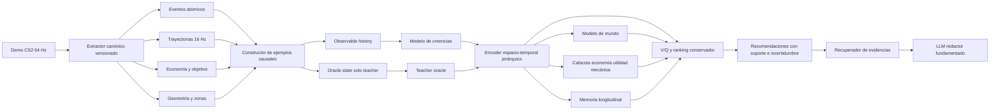

# Arquitectura de datos, modelos y entrenamiento para el coach de IA de CS2

> Estado: propuesta de arquitectura y auditoría técnica
>
> Fecha de corte: 24 de agosto de 2026
>
> Ámbito: StratAI y extractor Go de Faceit-Demos 3.7
>
> Fase: investigación y diseño; este documento no implementa el sistema de ML

## Alcance y criterio de la auditoría

Este documento consolida la auditoría del bundle de datos actual y propone una arquitectura para una IA personalizada que actúe como coach profesional de Counter-Strike 2. La propuesta no se limita a estadísticas tradicionales ni presupone que conceptos como `space_created`, `entry_value`, `good_push`, `correct_buy` o `team_intention` deban etiquetarse manualmente.

Se contrastaron los siguientes documentos de diseño con el código y los contratos reales:

- `StratAI/docs/AI_COACH_MASTER_PLAN.md`.
- `Faceit-Demos/docs/GO_DATA_AND_AI_COACH_AUDIT.md`.
- `StratAI/AI_COACH_ARCHITECTURE.md`.
- El extractor de `Faceit-Demos/go-service`, con especial atención a `parser/`, `models/`, `handlers/`, `analyzers/` y `pkg/`.

En todo el documento se usa esta taxonomía:

| Categoría | Significado |
|---|---|
| Observado | Procede directamente de la demo o de un evento del parser. |
| Derivado | Se calcula de forma determinista a partir de observaciones. |
| Inferido | Es una estimación probabilística; no está presente de forma directa. |
| No disponible | El extractor no lo observa ni lo publica con calidad suficiente. |
| En memoria, no publicado | El parser lo calcula durante el procesamiento, pero no forma parte del bundle persistido. |
| Latente aprendible | Puede emerger de estados, acciones, transiciones y objetivos de entrenamiento sin ser un label manual. |

Las referencias de código usan la forma `repositorio/ruta:líneas`. Las líneas corresponden al estado auditado y pueden desplazarse con cambios posteriores.

---

## 1. Resumen ejecutivo y veredicto de viabilidad

El producto es viable, pero el bundle actual debe entenderse como una base de telemetría y no como un dataset listo para entrenar directamente un coach contrafactual.

El corpus auditado ya permite:

- preentrenar representaciones de rondas, jugadores, equipos y mapas;
- predecir estados futuros, daño, muertes, trades, utilidad y resultado de ronda;
- aprender valor contextual de muchos comportamientos observados;
- construir perfiles longitudinales iniciales;
- separar parcialmente decisión táctica y ejecución mecánica;
- generar explicaciones respaldadas por eventos y ventanas temporales.

No permite todavía, con fiabilidad de producto:

- recomendar acciones contrafactuales finas fuera del soporte observado;
- razonar correctamente sobre sonido y ocultación acústica;
- medir micro-movimiento continuo desde `player_states` a 2 Hz;
- conocer la intención real del equipo o el rol asignado;
- atribuir causalmente el control de espacio o el valor de una rotación en todos los casos;
- evaluar alternativas sin modelar cobertura, incertidumbre y sesgo del comportamiento observado.

El hallazgo más grave es una fuga temporal en el contrato causal de engagements. La ventana previa a `T0` puede incluir como participantes a jugadores incorporados al engagement por acciones que ocurrieron después de `T0`. Además, `oracle_context` se publica como placeholder no disponible y varios gates de calidad de Block 7 no comprueban todavía las propiedades que declaran.

La recomendación no es entrenar un único Transformer sobre todos los JSON. La arquitectura adecuada combina:

1. un encoder espacio-temporal jerárquico;
2. un grafo dinámico de jugadores y zonas;
3. una representación explícita de creencias observables en `T0` separada del estado oracle;
4. preentrenamiento autosupervisado;
5. un modelo de mundo probabilístico;
6. modelos de valor y ranking conservadores;
7. cabezas especializadas de economía, utilidad y mecánica;
8. memoria longitudinal del jugador;
9. recuperación de evidencias y un LLM limitado a redactar explicaciones fundamentadas.

La ruta realista es incremental: primero predicción y ranking dentro del soporte; después contrafactuales restringidos; por último, offline RL conservador cuando haya diversidad suficiente y evaluación humana estable.

---

## 2. Qué contiene realmente el dataset actual

### 2.1 Corpus auditado

| Medida | Valor observado |
|---|---:|
| Demos procesadas | 296 |
| Rondas | 6.244 |
| Volumen aproximado | 23,49 GB |
| Tickrate predominante | 64 Hz |
| `player_states` publicados | 8.408.114 |
| Eventos de combate | 3.234.656 |
| Eventos de utilidad | 101.738 |
| Eventos de objetivo | 34.994 |
| Engagements / filas causales | 64.802 |
| Trades | 44.254 |
| Filas de economía por jugador | 62.861 |
| Filas de economía por equipo | 12.488 |
| Situaciones de clutch | 6.982 |
| Jugadores únicos | 1.659 |

El corpus pasa la validación de publicación y aparece como `usable=true`, aunque mantiene warnings. La etiqueta de usabilidad certifica integridad básica del artefacto, no ausencia de fuga temporal ni idoneidad causal.

La cobertura longitudinal es todavía corta:

| Partidas por jugador | Jugadores |
|---|---:|
| Al menos 2 | 629 |
| Al menos 5 | 93 |
| Al menos 10 | 8 |
| Máximo observado | 16 |

Las demos se concentran en una ventana temporal de unas 34 horas. Esto limita la estimación de progreso, adaptación a metagame, cambios de rol y estabilidad a largo plazo.

### 2.2 Resoluciones temporales y artefactos

| Artefacto o señal | Resolución / naturaleza | Uso recomendado | Restricción principal |
|---|---|---|---|
| Demo original | 64 ticks/s predominantes | Fuente de verdad para reexportar | Costosa para entrenamiento directo |
| Replay canónico | 16 Hz | Trayectorias, sincronización, contexto visual | No equivale a percepción subjetiva |
| `player_states` | 2 Hz | Macro-posicionamiento y secuencias largas | Insuficiente para counter-strafe fino |
| Combat ledger | Evento atómico | Daño, disparos, kills y atribución | Requiere revisar semántica por evento |
| Utility ledger | Evento y lifecycle | Uso y efectos de utilidad | Faltan algunas observaciones cinemáticas |
| Objective ledger | Evento atómico | Plant, defuse y objetivo | Hay drift documental de prefijos/eventos |
| Engagements | Episodios derivados | Contexto de enfrentamientos | Participantes pueden filtrar futuro |
| Causal partitions | Filas alrededor de `T0` | Predicción y valor contextual | Oracle incompleto y gates débiles |
| Economy | Snapshots por jugador/equipo | Modelos de compra y valor futuro | IDs fuente parcialmente sintéticos |
| Replay annotations | Derivadas | Evidencia visual para UI | No deben usarse como verdad causal |

El muestreo de `player_states` se realiza a 2 Hz, mientras que el replay canónico se exporta a 16 Hz. Por tanto, el replay es la fuente publicada más útil para trayectorias de corto plazo; aun así, la ejecución mecánica fina debería reconstruirse desde eventos de ticks o desde nuevas series específicas.

### 2.3 Datos observados directamente

El bundle expone o permite reconstruir directamente, según artefacto:

- posiciones, orientación, vida, armadura y estado vivo/muerto;
- equipo, SteamID e inventario visible en la demo;
- disparos, impactos, daño, kills, assists y headshots;
- eventos de granadas y ciertos efectos de utilidad;
- plant, defuse, explosión y resultado de ronda;
- dinero, equipamiento y compras registrados por el parser;
- marcador, mapa, lado y reloj de ronda;
- secuencias de replay con todos los jugadores.

La demo es un estado oracle: contiene información que un jugador real no necesariamente conocía, como posiciones e inventario exacto de enemigos. Que un campo sea observado por el parser no significa que sea una entrada válida para recomendar en `T0`.

### 2.4 Datos derivados

El extractor ya deriva, entre otros:

- engagements;
- trades;
- exposiciones y refinamientos de visibilidad;
- estadísticas de economía;
- contextos de ronda y ventanas alrededor de eventos;
- movimiento, reacción y mecánica en analizadores;
- geometría de mapas y callouts;
- proyecciones para replay y publicación web.

La derivación de engagements agrupa semillas de daño dentro de una ventana configurable de hasta cinco segundos (`Faceit-Demos/go-service/pkg/engagement/derive.go:130-148`). Después agrega todas las semillas como participantes (`build_engagements.go:182-202`) y usa ese conjunto para construir estados en `T0` (`parser/context.go:10-61`). Esta secuencia es la raíz de la fuga descrita en la sección 5.

### 2.5 Calculado en memoria pero no publicado

La auditoría identificó señales útiles que existen durante el parseo pero no llegan al contrato persistido:

- movimiento a intervalos de aproximadamente diez ticks;
- series usadas por los analizadores de mecánica, reacción y spray;
- mensajes de chat;
- parte del historial de arma activa;
- información de conectividad y hiding spots de navegación;
- estados intermedios de lifecycle de proyectiles y observaciones auxiliares.

Publicar selectivamente estas señales sería más valioso que aumentar indiscriminadamente el número de métricas agregadas.

### 2.6 Datos no disponibles o insuficientes

No hay una señal fiable y completa de:

- sonido emitido, propagación y audibilidad por jugador;
- input del jugador: teclas, intención de counter-strafe o comando exacto;
- rol asignado, plan táctico o intención del equipo;
- Elo/rank consistente y contexto competitivo de todos los participantes;
- visibilidad subjetiva perfecta y memoria humana del jugador;
- comunicaciones de voz;
- alternativas no elegidas;
- conexiones completas de navmesh en el bundle publicado;
- velocidad inicial del proyectil en todos los eventos de utilidad;
- probabilidades calibradas de economía enemiga conocidas en `T0`.

### 2.7 Calidad y representatividad

Los mapas y situaciones no están uniformemente distribuidos. Además, 1.659 jugadores y 296 demos no cubren de forma robusta la combinación de mapa, lado, zona, economía, arma, rol implícito, nivel de habilidad y fase de ronda.

Esto es suficiente para prototipos de representación y predicción, pero no para afirmar que una acción rara es mala porque el modelo no la ha observado. La cobertura debe medirse explícitamente por estado y acción, no solo por número total de filas.

---

## 3. Matriz de patrones

| Patrón | Detectable ahora | Aprendible con datos actuales | Transformación necesaria | Datos nuevos | Fiabilidad actual |
|---|---|---|---|---|---|
| Muertes repetidas en una zona sin impacto | Sí | Sí | Agregar por jugador, zona y consecuencias | No imprescindible | Media-alta |
| Zonas donde el jugador produce más valor | Sí | Sí | Embeddings de mapa y normalización por contexto | Más volumen longitudinal | Media |
| Entry que crea valor tras morir | Parcial | Sí | Ventanas post-entrada, ocupación y valor futuro | Semántica de zona mejorada | Media |
| Muerte tradeable | Sí, con reservas | Sí | Corregir definición espacial/temporal | No imprescindible | Baja-media |
| Sacrificio útil | Parcial | Sí | Valor contrafactual y crédito temporal | Más variedad | Baja-media |
| Exposición simultánea a enemigos | Parcial | Sí | Geometría y FOV por tick | Mejor oclusión/percepción | Media |
| Push aislado | Parcial | Sí | Velocidad, distancia al equipo y grafo dinámico | Plan/intención opcional | Media |
| Rotación prematura o tardía | Parcial | Sí | Definir eventos de decisión y belief state | Sonido/comunicaciones mejorarían | Baja-media |
| Muerte sin impacto posterior | Sí | Sí | Horizonte post-evento y baseline contextual | No | Alta descriptiva |
| Correr cuando convenía ocultar sonido | No | No fiable | Modelo acústico | Eventos de sonido/audibilidad | No identificable ahora |
| Counter-strafe deficiente | Parcial | Parcial | Serie de alta frecuencia alrededor del disparo | Publicar movimiento fino | Baja con 2 Hz |
| Crosshair placement | Parcial | Sí | Ángulo al threat plausible, geometría y visibilidad | Mejor belief state | Media |
| Reacción deficiente | Parcial | Sí | Primera oportunidad observable y latencia | Percepción refinada | Media-baja |
| Recarga/cambio de arma peligroso | Parcial | Sí | Publicar arma activa y lifecycle | Eventos completos | Media-baja |
| Mala utilización de utilidad | Sí, parcialmente | Sí | Efecto espacial, timing y valor futuro | Mejor geometría/lifecycle | Media |
| Utilidad que facilita entrada | Parcial | Sí | Crédito temporal multiagente | No imprescindible | Media |
| Compra individual incorrecta | Parcial | Sí | Belief de economía enemiga y valor a varias rondas | Más contextos económicos | Media |
| Compra incompatible con el equipo | Sí | Sí | Representación conjunta del equipo | Intención opcional | Media-alta |
| Patrón personal entre partidas | Parcial | Sí | Identidad estable, memoria y splits temporales | Más historial por jugador | Baja-media |
| Rendimiento por mapa/lado/zona/arma | Sí | Sí | Ajuste por dificultad y selección | Más cobertura | Alta descriptiva |
| Decisión mala salvada por aim | Parcial | Sí | Factorizar decisión y ejecución | Más repeticiones comparables | Media-baja |
| Decisión buena fallada por ejecución | Parcial | Sí | Modelo de valor previo a ejecución | Más repeticiones comparables | Media-baja |
| Intención real del equipo | No | Solo proxy latente | Inferencia de plan conjunto | Voz/estrategia/roles | No identificable directamente |

“Aprendible” no significa “identificado causalmente”. El modelo puede descubrir una representación predictiva correlacionada con crear espacio, pero para recomendar necesita controlar contexto, soporte de acciones, incertidumbre y horizonte de valor.

---

## 4. Conceptos que pueden emerger sin labels manuales

### 4.1 Representaciones latentes razonables

Los siguientes conceptos pueden aprenderse como variables latentes si se construyen objetivos adecuados:

- presión sobre una zona;
- control territorial efectivo;
- amenaza ofensiva y densidad defensiva;
- cohesión, aislamiento y capacidad de trade;
- intención táctica aproximada del equipo;
- rutas y timings habituales;
- valor de una entrada;
- espacio creado tras utilidad o movimiento;
- calidad relativa de una compra;
- estilo y rol emergente del jugador;
- estado de ejecución mecánica;
- incertidumbre sobre la ubicación y economía enemigas.

No emergen “porque haya muchos JSON”, sino porque el entrenamiento obliga al modelo a comprimir información útil para predecir transiciones y resultados.

### 4.2 Objetivos automáticos que inducen esas variables

| Objetivo automático | Representación que favorece |
|---|---|
| Reconstrucción enmascarada de jugadores/eventos | Contexto táctico y dependencias entre jugadores |
| Predicción de posiciones a 0,5/1/3/5 s | Movimiento, rotación e intención próxima |
| Predicción de ocupación de zonas | Control y presión territorial |
| Próximo evento de combate/objetivo | Fase táctica y riesgo inmediato |
| Daño, muerte, trade y supervivencia futuros | Exposición, cobertura y valor de duelo |
| Plant/defuse y control posterior | Valor de entry, utilidad y espacio |
| Resultado de ronda y partido | Valor de largo horizonte |
| Inventario y economía de rondas siguientes | Calidad de compras y saves |
| Contraste de dos vistas del mismo estado | Invariancia a muestreo y ruido |
| Identificación del jugador a través de partidas | Estilo persistente, con riesgo de memorizar identidad |
| Predicción oracle desde belief state | Calidad de la creencia sobre información oculta |

### 4.3 Conceptos que no deben confundirse con verdad observada

`team_intention`, “buena rotación” o “sacrificio útil” son constructos. Se pueden representar y usar predictivamente, pero no deben publicarse como hechos sin incertidumbre ni evidencia. El producto debe expresarlos como hipótesis: “el patrón es consistente con una rotación anticipada” y no “tu equipo quería ejecutar B”.

### 4.4 Separación entre decisión y ejecución

Se propone una factorización explícita:

\[
P(resultado \mid s,a,j) = \sum_z P(resultado \mid s,a,z)\,P(z \mid ejecución_j, contexto)
\]

Donde:

- `s` es el estado observable o belief state antes de decidir;
- `a` es la acción táctica abstraída;
- `z` representa la calidad de ejecución;
- `j` es el jugador y su perfil mecánico.

El valor de decisión se estima antes de observar la ejecución posterior. La calidad de ejecución se modela con señales como control de movimiento, crosshair, tiempo de reacción, spray y precisión condicionadas al duelo. Así se pueden distinguir:

- acción con buen valor esperado que falla por ejecución;
- acción con bajo valor esperado que funciona por una ejecución excepcional;
- acción y ejecución ambas buenas o ambas malas.

---

## 5. Limitaciones del contrato causal actual

### 5.1 Fuga por pertenencia futura al engagement

El conjunto de participantes de una fila causal se construye usando todas las semillas del engagement. Como el engagement puede extenderse hasta cinco segundos, un jugador que interviene después de `T0` puede aparecer en el contexto previo a `T0` como participante.

Cadena auditada:

1. `pkg/engagement/derive.go:130-148` agrupa daño dentro de la ventana temporal.
2. `build_engagements.go:182-202` agrega participantes desde todas las semillas.
3. `context.go:10-61` construye los estados de `T0` para ese conjunto completo.
4. `parser/block7_causal.go:66-122` incorpora el recuento y los features derivados.

No se filtran necesariamente posiciones futuras, pero sí se filtra una propiedad futura: quién acabará participando. En el corpus auditado, 4.100 de 64.802 engagements tienen más de dos participantes:

| Participantes | Engagements |
|---:|---:|
| 2 | 60.702 |
| 3 | 3.485 |
| 4 | 505 |
| 5 | 95 |
| 6 | 15 |

Corrección: definir `eligible_participants_at_t0` únicamente con información observable hasta `T0`, mantener por separado `eventual_participants` como outcome futuro y versionar el contrato.

### 5.2 `oracle_context` es un placeholder

`buildCanonicalCausalPartitions` inicializa `oracle_context` como no disponible (`parser/block7_causal.go:23-64`). También aparecen como no disponibles las variables causales de economía y exposición. Por ello, el contrato no implementa todavía la separación propuesta entre:

- estado oracle completo;
- observación legal del jugador;
- belief state inferido.

La ausencia explícita es preferible a inventar datos, pero el campo no debe interpretarse como funcional.

### 5.3 Gates de calidad insuficientes

Block 7 asigna el gate de integridad del artefacto, pero deja en cero o sin evaluación efectiva gates de futuro, leakage, causalidad, schema, determinismo y corpus (`parser/block7_quality.go:155-189`). La verificación de integridad (`parser/block7_quality.go:211-249`) comprueba existencia/forma básica, pero no recalcula recuentos semánticos ni exige todo el conjunto esperado.

`usable=true` no debe habilitar automáticamente entrenamiento causal. Hace falta un gate separado `causal_trainable=true` con pruebas de no-futuro.

### 5.4 Features demasiado agregados

Una sola fila por engagement pierde acciones dentro de la secuencia, cambios de ventaja, microtiming y alternativas plausibles. `decision_features.jsonl` debe ser una vista derivada para experimentos, no la fuente primaria del entrenamiento.

La unidad adecuada es una ventana secuencial alineada a un evento de decisión, con:

- historia observable pre-`T0`;
- acción o macro-acción realizada;
- transición post-`T0`;
- outcomes a múltiples horizontes;
- máscara de disponibilidad y procedencia por campo.

### 5.5 Tradeabilidad sin suficiente geometría

La lógica auditada considera esencialmente la presencia de algún compañero vivo (`trades.go:118-151` y `trades.go:249-263`). Eso no basta para afirmar que la muerte era tradeable. Deben incorporarse distancia, línea de visión, tiempo de llegada, orientación, arma, obstáculos, utilidad y exposición al mismo enemigo.

### 5.6 Otras fugas que deben bloquearse

- Inventario y posición enemigos exactos tomados del oracle en vez de una creencia legal.
- Estadísticas agregadas de final de ronda usadas como features en `T0`.
- Normalización calculada con el conjunto de test.
- Ventanas post-`T0` mezcladas con entradas por errores de joins.
- Identidad de demo o jugador que permita memorizar el resultado.
- Splits aleatorios de filas de una misma partida o del mismo jugador.
- Selección de acciones candidatas usando el desenlace real.
- Evidencias explicativas tomadas del futuro y presentadas como información disponible al decidir.

### 5.7 Contrato causal propuesto

Cada ejemplo debe publicar:

```text
example_id
match_id / round_id / player_id
t0_tick / t0_time
decision_type
observable_history
belief_state
oracle_state              # solo teacher/auditoría
action_taken
action_support_metadata
future_trajectory
multi_horizon_outcomes
execution_outcomes
availability_mask
lineage / schema_version
```

Las validaciones deben demostrar que cada feature de entrada tiene `source_tick <= t0_tick`, excepto los targets declarados.

---

## 6. Arquitecturas de modelos comparadas

Las estimaciones de coste son órdenes de magnitud relativos para el corpus actual; dependen de longitud de secuencia, dimensión, hardware y número de experimentos.

### 6.1 Transformer temporal

- **Inputs:** secuencia tokenizada de estados, eventos, economía, zonas, tiempo y acciones.
- **Outputs:** embeddings, próximos eventos, trayectorias y valor.
- **Acciones:** discretas o jerárquicas, por ejemplo mantener, avanzar a zona, retroceder, rotar, usar utilidad o comprar.
- **Objetivos:** masked modeling, next-event, future-state, outcome y contrastivo.
- **Rewards:** cambio de win probability, resultado de ronda/partido y auxiliares.
- **Ventana:** 10-30 s local; resumen jerárquico de ronda y partido.
- **Ventajas:** maneja dependencias largas y datos heterogéneos.
- **Limitaciones:** tokenización compleja y geometría multiagente implícita.
- **Datos:** bundle secuencial alineado y máscaras.
- **Leakage:** alto si se mezclan tokens oracle o futuros.
- **Coste:** medio-alto.
- **Personalización:** adapters, tokens de jugador o memoria.
- **Explicación:** atención no basta; debe recuperar evidencias y contrafactuales soportados.

### 6.2 Graph Neural Network

- **Inputs:** jugadores y zonas como nodos; aristas de distancia, visibilidad, equipo, amenaza y accesibilidad.
- **Outputs:** embeddings por jugador, equipo y escena.
- **Acciones:** movimiento/relación con zonas y compañeros.
- **Objetivos:** predicción de aristas, posiciones, eventos y outcomes.
- **Rewards:** valor multiagente y resultado futuro.
- **Ventana:** snapshots o secuencias cortas.
- **Ventajas:** sesgo inductivo natural para interacción táctica.
- **Limitaciones:** por sí sola modela peor la historia larga.
- **Datos:** geometría consistente y grafo por timestamp.
- **Leakage:** medio; depende de nodos y aristas oracle.
- **Coste:** medio.
- **Personalización:** embedding por nodo/jugador.
- **Explicación:** relaciones explícitas: aislamiento, doble exposición, capacidad de trade.

### 6.3 Graph Transformer temporal

- **Inputs:** grafos dinámicos de jugadores/zonas más tokens de eventos.
- **Outputs:** estado latente de escena y trayectorias multiagente.
- **Acciones:** macro-acciones individuales y conjuntas.
- **Objetivos:** reconstrucción enmascarada, transición y outcome.
- **Rewards:** multi-horizonte y multiagente.
- **Ventana:** 5-30 s más memoria resumida.
- **Ventajas:** combina relaciones espaciales con contexto temporal.
- **Limitaciones:** mayor complejidad y consumo de memoria.
- **Datos:** grafos temporales precomputados o construidos online.
- **Leakage:** alto si las aristas usan conocimiento futuro.
- **Coste:** alto.
- **Personalización:** memoria y adapters por jugador.
- **Explicación:** subgrafos y eventos causales recuperables.

### 6.4 Modelo espacio-temporal híbrido

- **Inputs:** raster/mesh de mapa, entidades, eventos y estado global.
- **Outputs:** mapas de ocupación/amenaza, embeddings de escena y futuros.
- **Acciones:** destino, ruta, timing y uso de utilidad.
- **Objetivos:** occupancy forecasting, trayectoria, evento y valor.
- **Rewards:** control posterior, supervivencia, objetivo y victoria.
- **Ventana:** 3-20 s.
- **Ventajas:** especialmente fuerte en control territorial y rotaciones.
- **Limitaciones:** depende de semántica y geometría de mapa de calidad.
- **Datos:** navmesh, callouts, visibilidad y alturas.
- **Leakage:** medio-alto si el mapa de amenaza incluye enemigos no observables.
- **Coste:** alto.
- **Personalización:** head condicionado por estilo/ruta.
- **Explicación:** mapas de riesgo, rutas y zonas comparables.

### 6.5 Modelo de mundo

- **Inputs:** estado latente observable, belief state y acción.
- **Outputs:** distribución del siguiente estado, eventos y outcomes.
- **Acciones:** macro-acciones restringidas al soporte.
- **Objetivos:** dinámica latente, reconstrucción, reward y terminación.
- **Rewards:** vector multi-horizonte con victoria como objetivo terminal.
- **Ventana:** rollouts de 1-20 s; modelo jerárquico para rondas siguientes.
- **Ventajas:** permite evaluar consecuencias y separar azar/ejecución.
- **Limitaciones:** error compuesto y futuros multimodales.
- **Datos:** transiciones densas y acciones abstraídas.
- **Leakage:** alto si el estado inicial no es causal.
- **Coste:** alto.
- **Personalización:** dinámica o ejecución condicionadas por jugador.
- **Explicación:** compara futuros previstos y su incertidumbre.

### 6.6 Value model `V(s)` / `Q(s,a)`

- **Inputs:** estado o belief state y acción candidata.
- **Outputs:** valor esperado, distribución y confianza.
- **Acciones:** macro-acciones discretas, parametrizadas o recuperadas de vecinos.
- **Objetivos:** retorno temporal, distribución de outcomes y consistencia Bellman conservadora.
- **Rewards:** cambio de probabilidad de victoria, ronda, supervivencia, economía futura y objetivos auxiliares.
- **Ventana:** decisión local con retorno a ronda/partido.
- **Ventajas:** produce ranking directo y separa decisión de ejecución.
- **Limitaciones:** Q extrapola con peligro fuera de distribución.
- **Datos:** cobertura por acción y estimación de comportamiento.
- **Leakage:** medio si el estado es causal; muy alto si no.
- **Coste:** medio.
- **Personalización:** Q condicionado por capacidad mecánica estimada.
- **Explicación:** diferencia de valor entre acción tomada y alternativas soportadas.

### 6.7 Offline reinforcement learning

- **Inputs:** transiciones `(s,a,r,s')`, máscara de soporte y comportamiento.
- **Outputs:** política o función de valor conservadora.
- **Acciones:** espacio restringido y jerárquico.
- **Objetivos:** CQL, IQL u objetivos similares que penalicen acciones fuera de distribución.
- **Rewards:** retorno descontado multi-horizonte.
- **Ventajas:** optimiza decisiones secuenciales.
- **Limitaciones:** confounding, falta de cobertura y evaluación difícil.
- **Datos:** mucho más diversos que los actuales para política general.
- **Leakage:** crítico.
- **Coste:** medio-alto, pero el coste científico supera al computacional.
- **Personalización:** política condicionada por jugador y nivel, con regularización.
- **Explicación:** requiere modelo de valor y evidencias; la política sola no explica.

### 6.8 Modelos auxiliares especializados

- **Inputs:** subconjuntos específicos: economía, utilidad, mecánica, objetivo.
- **Outputs:** embeddings y predicciones de dominio.
- **Acciones:** compras, tipo/timing/objetivo de utilidad o ejecución mecánica.
- **Objetivos:** targets automáticos específicos y valor futuro.
- **Rewards:** adecuados a cada horizonte, sin sustituir la victoria final.
- **Ventana:** desde milisegundos mecánicos hasta varias rondas económicas.
- **Ventajas:** mejor resolución, depuración y calibración.
- **Limitaciones:** riesgo de optimizar proxies locales.
- **Datos:** series y contratos especializados.
- **Leakage:** controlable por cabeza.
- **Coste:** bajo-medio por módulo.
- **Personalización:** muy alta en mecánica y hábitos.
- **Explicación:** métricas y ejemplos concretos del dominio.

### 6.9 Memoria longitudinal del jugador

- **Inputs:** embeddings de partidas anteriores, contexto y métricas calibradas.
- **Outputs:** perfil posterior, tendencias, fortalezas y debilidades.
- **Acciones:** no decide sola; condiciona el ranking y el coaching.
- **Objetivos:** predicción de comportamiento futuro, contraste temporal y detección de cambio.
- **Rewards:** mejora futura y estabilidad, no solo resultado inmediato.
- **Ventana:** semanas o meses.
- **Ventajas:** personalización real y seguimiento de aprendizaje.
- **Limitaciones:** escasez actual, privacidad y drift.
- **Datos:** historial estable, timestamps y nivel competitivo.
- **Leakage:** splits temporales estrictos.
- **Coste:** bajo-medio.
- **Explicación:** compara el evento con patrones previos del mismo jugador y peers.

### 6.10 LLM como generador de explicaciones

- **Inputs:** claims estructurados, evidencias, incertidumbre y recomendaciones ya calculadas.
- **Outputs:** explicación en lenguaje natural.
- **Acciones:** ninguna acción táctica autónoma.
- **Objetivos:** fidelidad, claridad, cobertura y abstención.
- **Rewards:** evaluación humana y factualidad de claims.
- **Ventana:** evento, ronda, partida y perfil.
- **Ventajas:** conversación y pedagogía.
- **Limitaciones:** puede inventar causalidad o certeza.
- **Datos:** plantillas, evidencias y ejemplos revisados.
- **Leakage:** el prompt debe separar información disponible en `T0` de outcomes explicativos.
- **Coste:** bajo para inferencia estructurada; variable si se ajusta.
- **Personalización:** tono, nivel y plan de mejora.
- **Explicación:** es la capa de redacción, no la fuente de verdad.

---

## 7. Arquitectura final recomendada



### 7.1 Encoder espacio-temporal jerárquico

Debe tener cuatro niveles:

1. **Entidad:** estado de cada jugador, proyectil, arma y objetivo.
2. **Escena:** grafo dinámico entre jugadores y zonas.
3. **Ronda:** Transformer temporal sobre snapshots y eventos.
4. **Partido/perfil:** resúmenes de rondas y memoria longitudinal.

Los nodos de jugador incorporan posición, orientación, velocidad, estado, arma, equipo, zona y visibilidad legal. Las aristas representan proximidad, línea de visión, amenaza, capacidad estimada de trade, conectividad de mapa y pertenencia a equipo.

### 7.2 Doble estado: oracle y belief

- **Oracle teacher:** usa la demo completa para aprender dinámica, ocupación y variables ocultas.
- **Belief student:** solo recibe información que el jugador podía observar o inferir hasta `T0`.
- **Distillation:** el student aprende distribuciones, no copia hechos imposibles de conocer.
- **Recomendación:** siempre usa el belief student.

El belief state debe representar distribuciones de ubicación, arma y economía enemigas, con entropía/confianza.

### 7.3 Modelo de mundo probabilístico

Predice futuros multimodales condicionados al estado y a una macro-acción. No debe generar una única trayectoria determinista. Las salidas mínimas son:

- ocupación por zona;
- posiciones aproximadas;
- próximo combate/objetivo;
- daño, muerte y supervivencia;
- plant/defuse;
- estado económico siguiente;
- win probability a varios horizontes;
- incertidumbre epistémica y aleatoria.

### 7.4 Ranking conservador

El recomendador genera o recupera pocas alternativas plausibles y las puntúa con:

\[
score(s,a)=\mathbb{E}[R\mid s,a]-\lambda_u U(s,a)-\lambda_o OOD(s,a)
\]

Donde `U` es incertidumbre y `OOD` penaliza distancia al soporte del dataset. Si no hay alternativas comparables, el sistema debe abstenerse de afirmar que una opción era mejor.

### 7.5 Cabezas especializadas

- **Economía:** estado a varias rondas, compras y probabilidad de victoria del partido.
- **Utilidad:** cobertura, desplazamiento, daño evitado/generado y facilitación posterior.
- **Mecánica:** reacción, crosshair, movimiento, spray y ejecución condicionada.
- **Objetivo:** plant/defuse/save y presión temporal.

Estas cabezas comparten el encoder, pero mantienen resoluciones y targets propios.

### 7.6 Memoria longitudinal

Mantiene un posterior del jugador, no una etiqueta fija. Debe poder olvidar o ponderar menos partidas antiguas, modelar cambios de estilo y separar habilidad de dificultad del contexto.

### 7.7 Capa de explicación

El LLM recibe un objeto estructurado con:

- claim permitido;
- acción observada;
- alternativas soportadas;
- diferencia de valor e intervalo;
- eventos y frames de evidencia;
- comparación con baseline personal y de peers;
- limitaciones y nivel de confianza.

Nunca recibe libertad para inventar el análisis táctico desde el bundle crudo.

---

## 8. Pipeline de construcción del dataset

### 8.1 Ingesta y versionado

1. Conservar la demo como fuente inmutable.
2. Publicar manifest con hashes, parser version, schema version y configuración.
3. Validar que todos los artefactos pertenezcan a la misma ejecución.
4. Registrar disponibilidad y lineage por campo.

La publicación actual es vulnerable a bundles parciales si el proceso falla entre escrituras. Se recomienda escribir en un directorio temporal, validar allí y hacer promoción atómica del manifest y artefactos.

### 8.2 Normalización espacial y temporal

- Coordenadas globales más coordenadas relativas a zonas/callouts.
- Orientación y velocidades normalizadas.
- Timestamps absolutos de demo, relativos a ronda y relativos a `T0`.
- Muestreo base a 8-16 Hz para táctica.
- Ventanas de alta frecuencia centradas en disparos, counter-strafe, reacción y cambios de arma.
- Eventos atómicos preservados sin cuantización innecesaria.

### 8.3 Event store y trajectory store

Separar físicamente:

- **Event store:** disparos, daño, kills, utilidad, sonido, compra y objetivo.
- **Trajectory store:** estados densos por entidad.
- **Decision store:** ejemplos causales construidos y versionados.
- **Profile store:** resúmenes temporales por jugador.

JSONL es útil para inspección, pero el entrenamiento a escala debería usar Parquet/Arrow con particionado por mapa, fecha y match, más índices para ventanas.

### 8.4 Detección de decisiones

No toda muestra temporal es una decisión. Se deben detectar candidatos como:

- cruce de frontera de zona;
- cambio de ruta o velocidad;
- inicio de rotación;
- peek/exposición;
- separación del equipo;
- uso de utilidad;
- recarga/cambio de arma;
- compra/drop/save;
- compromiso con plant/defuse;
- entrada o abandono de site.

Algunos detectores serán heurísticos al principio. Su función es proponer `T0`, no etiquetar si la decisión fue buena o mala.

### 8.5 Ventanas causales

Para cada `T0`:

- historia corta: 5-15 s;
- contexto de ronda resumido desde el inicio;
- acción entre 0,25 y 2 s, según tipo;
- outcomes a 1, 3, 5, 10 y 20 s;
- resultado de ronda;
- efectos económicos a 1-3 rondas;
- resultado de partido.

### 8.6 Acciones jerárquicas

Evitar una acción cartesiana enorme. Usar niveles:

1. intención macro: mantener, avanzar, retirarse, rotar, apoyar, guardar;
2. objetivo espacial: zona/callout/compañero;
3. herramienta: arma o utilidad;
4. parámetros continuos: dirección, timing y destino.

Las acciones candidatas deben provenir de vecinos observados, rutas válidas o un generador restringido por navmesh y soporte.

### 8.7 Splits

- Separar por partido y jugador; nunca por fila aleatoria.
- Test temporal posterior al train.
- Holdouts por mapa, nivel y patch cuando sea posible.
- Benchmark de generalización a jugadores nuevos.
- Benchmark longitudinal donde solo se use el pasado del jugador.

### 8.8 Validaciones obligatorias

- No-future por timestamp y lineage.
- Integridad referencial entre eventos y trayectorias.
- Reproducibilidad/determinismo.
- Distribuciones y cobertura por acción.
- Comparación con un golden corpus.
- Detección de drift de schema.
- Tests de información imposible: entrenar probes para comprobar si inputs predicen indebidamente outcomes futuros.

---

## 9. Preentrenamiento autosupervisado

### 9.1 Objetivos principales

1. **Masked entity modeling:** ocultar campos o jugadores y reconstruirlos.
2. **Masked event modeling:** ocultar eventos de combate/utilidad/objetivo.
3. **Future occupancy:** predecir ocupación por zona y horizontes.
4. **Trajectory forecasting:** distribución de movimiento futuro.
5. **Next event and time-to-event:** tipo y tiempo del siguiente evento.
6. **Cross-view consistency:** alinear replay, eventos y snapshots.
7. **Team contrastive learning:** estados cercanos coherentes frente a negativos controlados.
8. **Oracle-to-belief distillation:** aproximar distribuciones ocultas con información legal.
9. **Temporal order:** detectar orden alterado de subtrayectorias.
10. **Map-aware objectives:** ruta plausible, visibilidad y conectividad de zonas.

### 9.2 Currículum recomendado

- Fase A: una ronda, snapshots y eventos, sin identidad de jugador.
- Fase B: secuencias multiagente y geometría.
- Fase C: estados observables frente a oracle.
- Fase D: partido completo y economía multirronda.
- Fase E: memoria longitudinal y personalización.

### 9.3 Evitar atajos

- Randomizar o controlar IDs que codifiquen la demo.
- Balancear mapas y resultados.
- Enmascarar campos triviales que revelen el target.
- Medir probes de leakage.
- Comparar con baselines sencillos para comprobar que la ganancia procede de contexto real.

---

## 10. Modelo de mundo y función de valor

### 10.1 Rewards automáticos

No hacen falta labels manuales de “buena decisión”, pero sí una función objetivo explícita. Se recomienda un reward vector antes de escalarizar:

```text
r_win_match
r_win_round
r_delta_win_probability
r_objective
r_survival
r_damage_and_trade
r_space_or_occupancy_future
r_utility_effect
r_economy_next_rounds
r_information
r_execution
```

La victoria de partido debe ser el objetivo terminal. Los componentes intermedios aceleran aprendizaje y crédito, pero no deben reemplazarla. Para evitar reward hacking, aprender también una función de valor directamente desde resultados y comprobar si los proxies cambian el orden de acciones de forma incoherente.

### 10.2 Horizontes

| Horizonte | Qué captura |
|---|---|
| 0,25-1 s | ejecución inmediata, exposición y disparo |
| 1-5 s | duelo, trade, entrada y uso de utilidad |
| 5-20 s | control de site, rotación y objetivo |
| Fin de ronda | victoria y recursos conservados |
| 1-3 rondas | consecuencias económicas |
| Fin de partido | objetivo final del producto |

Se recomienda value distributional y multi-horizonte, no un único escalar temprano.

### 10.3 Win probability como potencial

Una señal densa útil es:

\[
r_t^{WP}=\hat P(win\mid s_{t+1})-\hat P(win\mid s_t)
\]

Debe calcularse con modelos cross-fitted para evitar usar el mismo ejemplo como train y target. Para el estado observable se requiere una versión belief-aware; el oracle puede actuar como teacher y auditor.

### 10.4 Factorización de resultado

El modelo debe producir al menos:

- `decision_value_before_execution`;
- `expected_execution_given_player`;
- `actual_execution_residual`;
- `outcome_luck_or_unmodeled_residual`;
- intervalos de incertidumbre.

Esto habilita explicaciones como: “la ruta tenía valor positivo, pero el disparo se realizó antes de estabilizar el movimiento”.

---

## 11. Offline RL o ranking de acciones

### 11.1 Problema contrafactual

La demo solo muestra una acción. El resultado de alternativas no observadas no está identificado sin supuestos. La solución práctica combina varias fuentes:

- acciones similares en estados similares;
- modelo de mundo aprendido;
- value model conservador;
- nearest-neighbor counterfactuals;
- restricciones geométricas;
- política de comportamiento estimada;
- incertidumbre y abstención.

### 11.2 Orden recomendado de madurez

1. **Behavior cloning** para aprender qué acciones son plausibles.
2. **Ranking supervisado por retornos observados ajustados por contexto**.
3. **Nearest-neighbor counterfactuals** con matching de estado.
4. **Q conservador** con CQL/IQL y soporte explícito.
5. **Rollouts cortos del modelo de mundo**.
6. **Offline RL jerárquico** solo tras validar cobertura y OPE.

### 11.3 Generación de alternativas

Una alternativa es admisible si:

- existe en vecinos suficientemente similares;
- es válida en navmesh y tiempo disponible;
- su probabilidad bajo la política de comportamiento supera un umbral;
- el modelo tiene incertidumbre aceptable;
- no depende de información oracle en `T0`.

Para acciones continuas se recomienda recuperar trayectorias prototipo y ajustar parámetros localmente, en vez de inventar rutas arbitrarias.

### 11.4 Conservative Q-Learning e Implicit Q-Learning

CQL penaliza valores altos para acciones no respaldadas por el dataset. IQL evita consultar explícitamente acciones fuera de distribución durante gran parte del aprendizaje. Son candidatos razonables, pero no corrigen por sí solos confounding, estado parcial ni rewards mal definidos.

### 11.5 Evaluación off-policy

Usar varias estimaciones y no confiar en una sola:

- Fitted Q Evaluation;
- importance sampling truncado cuando sea viable;
- doubly robust estimators;
- evaluación con modelo de mundo calibrado;
- replay de casos comparables;
- revisión humana ciega.

Si las estimaciones discrepan, el sistema debe marcar la recomendación como no concluyente.

---

## 12. Personalización entre partidas

### 12.1 Perfil dinámico

El perfil debe ser una distribución actualizable con:

- estilo posicional y rutas;
- agresividad condicionada;
- timings;
- calidad mecánica por arma/situación;
- uso de utilidad;
- decisiones económicas;
- rendimiento por mapa/lado/zona;
- adaptación y tendencia temporal;
- incertidumbre por falta de muestras.

### 12.2 Arquitectura

- Encoder común global.
- Memoria recurrente o attention sobre resúmenes de partidas previas.
- Embedding de jugador regularizado.
- Adapters pequeños o hypernetwork para personalización cuando haya suficientes datos.
- Priors poblacionales para jugadores nuevos.

### 12.3 Jerarquía bayesiana

Usar un prior global, actualizar por cohortes comparables y finalmente por jugador. Esto evita concluir demasiado pronto que un jugador tiene un patrón personal a partir de una o dos partidas.

### 12.4 Comparaciones válidas

Cada observación personal debe ajustarse por:

- mapa, lado y zona;
- nivel de rivales y compañeros;
- economía;
- arma;
- fase de ronda;
- rol emergente;
- versión del juego;
- tamaño de muestra.

### 12.5 Privacidad y control

Los embeddings longitudinales son datos personales derivados. Deben tener política de retención, borrado, aislamiento por usuario y trazabilidad. El usuario debe poder distinguir análisis de una partida y conclusiones de su historial.

---

## 13. Generación de explicaciones y evidencias

### 13.1 Contrato de claim

Cada explicación debe nacer de un registro estructurado:

```json
{
  "claim_type": "isolated_push",
  "t0": 83.42,
  "observed_action": "advance_to_zone",
  "alternative": "hold_for_teammate",
  "value_delta": 0.07,
  "confidence": 0.71,
  "support": "in_distribution",
  "evidence_ids": ["frame_...", "event_..."],
  "limitations": ["enemy_position_is_belief"]
}
```

El LLM verbaliza únicamente esos claims.

### 13.2 Estructura de una explicación útil

1. Qué ocurrió.
2. Qué información era razonable en ese momento.
3. Por qué aumentó o redujo el valor esperado.
4. Qué alternativa comparable existía.
5. Qué parte fue decisión y cuál ejecución.
6. Evidencia visual y eventos.
7. Confianza y limitación.
8. Ejercicio o regla práctica personalizada.

### 13.3 Ejemplo de salida

> Entraste en la zona 1,8 s antes de que tu compañero pudiera verte o tradearte. En estados comparables de este mapa, esperar detrás de la cobertura hasta recuperar esa conexión mantiene más opciones y mejora el valor estimado de ronda. El duelo posterior lo ganaste por buena ejecución mecánica; eso no elimina el riesgo de la decisión. Confianza media: la posición del segundo defensor es una creencia, no información observada por ti.

### 13.4 Salvaguardas

- No usar atención como explicación causal.
- No afirmar intención interna.
- Citar frames y eventos exactos.
- Separar evidencia disponible en `T0` de consecuencias posteriores.
- Abstenerse si la alternativa es OOD.
- Mostrar intervalos o categorías de confianza.
- Mantener plantillas deterministas para claims de alto riesgo.

---

## 14. Evaluación offline y benchmark humano

### 14.1 Calidad de datos

- Exactitud de timestamps y joins.
- Cobertura de campos.
- Determinismo.
- Tasa de ejemplos con leakage.
- Coherencia entre replay y ledgers.
- Calibración del belief state.

### 14.2 Representaciones y predicción

- Error de trayectoria y ocupación.
- Accuracy/F1 del próximo evento.
- Brier score y Expected Calibration Error de win probability.
- NLL para futuros multimodales.
- Probes de zona, fase, cohesión y economía.
- Generalización por jugador, mapa y tiempo.

### 14.3 Decisión y valor

- Concordancia de ranking en pares de acciones comparables.
- Error de FQE/OPE con intervalos.
- Regret en simulaciones controladas.
- Ventaja sobre behavior cloning y heurísticas.
- Tasa de acciones OOD recomendadas.
- Tasa de abstención y precisión condicionada a cobertura.

### 14.4 Separación decisión/ejecución

Crear casos contrabalanceados:

- misma decisión, distinta ejecución;
- ejecución similar, decisiones distintas;
- resultado positivo con valor previo bajo;
- resultado negativo con valor previo alto.

Medir si el modelo conserva el orden esperado antes de revelar el desenlace.

### 14.5 Benchmark humano

Panel de coaches con revisión ciega y protocolo explícito:

- corrección táctica;
- utilidad práctica;
- fidelidad a evidencia;
- separación decisión/ejecución;
- calidad de alternativa;
- calibración de confianza;
- claridad pedagógica.

Usar acuerdo interanotador y adjudicación. Los labels humanos sirven para evaluación, calibración y seguridad, no necesariamente como señal primaria de entrenamiento.

### 14.6 Tests adversariales

- Ocultar enemigos no observables y comprobar estabilidad.
- Permutar IDs de jugador.
- Cambiar el outcome posterior manteniendo el prefijo.
- Introducir acciones fuera de navmesh.
- Evaluar estados raros y mapas holdout.
- Buscar explicaciones contradictorias con el mismo estado.

### 14.7 Criterios de salida sugeridos

No activar recomendaciones prescriptivas hasta que:

- leakage crítico sea cero en el golden corpus;
- la calibración sea aceptable por mapa y skill band;
- el ranking supere baselines sencillos;
- la tasa de recomendación OOD sea inferior al umbral acordado;
- coaches validen fidelidad y utilidad;
- el sistema se abstenga correctamente en casos sin soporte.

---

## 15. Cambios concretos necesarios en el extractor Go

### P0: bloqueantes para causalidad

1. Corregir participantes en `T0`: separar `eligible_participants_at_t0` y `eventual_participants`.
2. Implementar tests de no-futuro por campo y por join.
3. Hacer funcional la separación `observable_context`, `belief_targets` y `oracle_context`.
4. Activar gates reales de future/leakage/causal/schema/determinism/corpus.
5. Versionar el schema causal corregido y no mezclarlo con 3.7.
6. Promoción atómica de bundles para impedir publicaciones parciales.

### P1: señales que desbloquean el MVP

1. Publicar acciones explícitas: fire, reload, weapon switch, scope, jump, crouch y use.
2. Publicar movimiento de alta frecuencia alrededor de eventos mecánicos.
3. Publicar historial de arma activa y ammo consistente.
4. Añadir visibilidad/FOV legal por jugador y calidad de la observación.
5. Mejorar tradeability con distancia, LOS y tiempo de llegada.
6. Publicar lifecycle completo de utilidad, incluidos rebotes/impactos y velocidad cuando sea recuperable.
7. Exportar semántica de zonas y conectividad del navmesh.
8. Garantizar IDs fuente estables y no sintéticos en economía.
9. Corregir drift documental de eventos de objetivo y conteo de artefactos.

### P2: coach avanzado

1. Eventos de sonido: fuente, tipo, intensidad y jugadores potencialmente audientes.
2. Modelo de propagación acústica aproximada por mapa.
3. Comunicación disponible: chat publicado; voz solo con consentimiento y contrato separado.
4. Roles/rank externos cuando tengan fuente fiable y permiso.
5. Topología completa del navmesh, hiding spots y rutas.
6. Observaciones de amenaza/crosshair contra posiciones plausibles, no solo oracle.
7. Eventos de decisión explícitos derivados y versionados.

### Cambios sobre componentes auditados

| Área | Cambio |
|---|---|
| `parser/block7_causal.go` | Reconstruir contexto causal con corte estricto en `T0`; publicar observable/oracle/belief targets. |
| `parser/block7_quality.go` | Gates semánticos ejecutables y recálculo de checks. |
| `pkg/engagement/` | Diferenciar participantes conocidos en `T0` de participantes futuros. |
| `pkg/combat/` | Asegurar atomicidad, lineage y ventanas de ejecución. |
| `pkg/economy/` | IDs estables, contexto multirronda y disponibilidad en `T0`. |
| `pkg/objective/` | Contrato consistente de eventos y clocks. |
| `pkg/playerstate/` | Series de movimiento y arma a resolución adecuada. |
| `pkg/utility/` | Lifecycle, trayectoria y efectos espaciales completos. |
| `pkg/maps/` | Conectividad, zonas, LOS y semántica versionada. |
| `handlers/` y `analyzers/` | Publicar selectivamente señales hoy solo en memoria. |

---

## 16. Nuevos ficheros y campos a publicar

### 16.1 Artefactos propuestos

| Fichero | Contenido |
|---|---|
| `manifest_v4.json` | Hashes, versiones, configuración, gates y lineage. |
| `entity_trajectories.parquet` | Trayectorias densas a 8-16 Hz con máscaras. |
| `atomic_actions.parquet` | Disparo, movimiento, recarga, cambio, salto, scope y uso. |
| `sound_events.parquet` | Eventos y audibilidad estimada. |
| `map_topology.parquet` | Zonas, edges, alturas, callouts y visibilidad estática. |
| `visibility_observations.parquet` | Quién podía observar qué, cuándo y con qué confianza. |
| `decision_points.parquet` | `T0`, tipo, actor, acción y detectores. |
| `causal_examples.parquet` | Prefijo observable, belief, oracle teacher, outcomes y soporte. |
| `round_trajectories.parquet` | Resumen jerárquico para ronda/partido. |
| `player_match_embeddings.parquet` | Resúmenes para memoria longitudinal, con versión de modelo. |
| `evidence_index.jsonl` | Referencias a frames, eventos y claims explicables. |

### 16.2 Campos mínimos por entidad temporal

```text
match_id, demo_hash, round_id, tick, game_time
entity_id, player_id, team, side
position, velocity, view_angles, stance
health, armor, alive, active_weapon, ammo
zone_id, nav_area_id
visibility_mask, observation_source, availability
schema_version, extractor_version, lineage_id
```

### 16.3 Campos de acciones

```text
action_id, actor_id, start_tick, end_tick
action_type, target_entity, target_zone
movement_vector, view_delta
weapon_id, utility_id
preconditions, support_bucket
```

### 16.4 Campos de ejemplo causal

```text
t0_tick
observable_entity_ids
eligible_participants_at_t0
eventual_participants          # target, nunca feature
belief_distribution_refs
oracle_state_ref               # teacher, nunca recomendación
action_taken
candidate_action_refs
outcomes_1s_3s_5s_10s_20s
round_outcome, future_economy, match_outcome
execution_metrics
availability_mask
leakage_audit_version
```

No todos los campos tienen que duplicarse en cada fila. Se deben usar referencias a stores columnares y ventanas materializadas reproducibles.

---

## 17. Roadmap por fases

### Fase 0: saneamiento del contrato, 2-4 semanas

- Corregir fuga de participantes.
- Implementar gates causales.
- Congelar schema v4.
- Construir golden corpus y tests de leakage.
- Alinear documentación y contratos.

**Salida:** dataset causal auditable, todavía sin coach prescriptivo.

### MVP: 6-10 semanas adicionales

- Dataset secuencial de ronda.
- Encoder temporal/grafo pequeño.
- Preentrenamiento masked + future prediction.
- Win probability calibrada.
- Cabezas de patrón descriptivo y ejecución.
- Ranking de alternativas observadas/nearest neighbors.
- Evidencias y explicaciones estructuradas.
- Perfil personal básico con shrinkage.

**Producto:** coach que detecta patrones, compara con casos similares y ofrece recomendaciones conservadoras con confianza.

**Cómputo orientativo:** una a cuatro GPUs de 24-48 GB para iteración; decenas a pocos cientos de GPU-horas según secuencias y búsqueda de hiperparámetros.

### Versión intermedia: 3-5 meses

- Grafo espacio-temporal completo.
- Belief model destilado desde oracle.
- Geometría/map topology enriquecida.
- Modelo de mundo de rollout corto.
- Q conservador y OPE.
- Módulos especializados de economía, utilidad y mecánica.
- Memoria longitudinal robusta.
- Benchmark humano periódico.

**Producto:** explica decisión frente a ejecución y recomienda alternativas dentro del soporte.

**Cómputo orientativo:** cuatro a ocho GPUs modernas para campañas; cientos a pocos miles de GPU-horas, más reexportación y almacenamiento.

### Coach avanzado: 6-12+ meses

- Sonido y observabilidad realista.
- Rollouts multimodales y jerárquicos.
- Offline RL conservador por tipos de decisión.
- Valor multirronda y de partido.
- Adaptación por nivel, rol y evolución personal.
- Evaluación continua con coaches y experimentos de producto.
- Explicaciones conversacionales con recuperación de evidencia.

**Producto:** coach prescriptivo calibrado que razona sobre alternativas, se abstiene fuera de cobertura y acompaña el progreso del jugador.

### Prioridad de datos

Antes de aumentar el tamaño del modelo:

1. eliminar leakage;
2. ampliar diversidad de demos y jugadores longitudinales;
3. publicar acciones/movimiento fino;
4. mejorar mapa, visibilidad y sonido;
5. construir evaluación humana y causal.

---

## 18. Riesgos técnicos y errores conceptuales que debemos evitar

1. **Entrenar sobre `decision_features.jsonl` como verdad suficiente.** Pierde secuencia y puede contener fugas estructurales.
2. **Confundir oracle con información del jugador.** Produce recomendaciones imposibles.
3. **Interpretar correlación como causalidad.** Una zona puede parecer mala porque se visita en rondas ya perdidas.
4. **Optimizar kills o daño.** Puede castigar entries útiles, saves y utilidad.
5. **Premiar proxies de espacio sin anclaje.** El modelo puede aprender ocupación inútil.
6. **Generar alternativas fuera del soporte.** Q y world model suelen ser optimistas en OOD.
7. **Ignorar política de comportamiento.** Los datos proceden de jugadores y niveles concretos.
8. **Splits por fila.** Filtra partidas, rivales y estilo del jugador.
9. **Personalizar con pocas muestras sin shrinkage.** Convierte ruido en diagnóstico.
10. **Usar un LLM como analista primario.** Puede producir narrativas convincentes sin evidencia.
11. **Usar atención como prueba causal.** Atención no demuestra por qué ocurrió un resultado.
12. **No factorizar decisión y ejecución.** Penaliza buenas decisiones fallidas y refuerza malas decisiones afortunadas.
13. **Reward hacking.** Proxies locales pueden alejarse de ganar el partido.
14. **Error compuesto del world model.** Rollouts largos se vuelven poco fiables.
15. **Falta de incertidumbre y abstención.** El sistema parecerá seguro justo donde tiene menos datos.
16. **Olvidar cambios de versión y metagame.** Las políticas y mapas cambian.
17. **Drift documental.** Contratos descritos y publicados deben verificarse automáticamente.
18. **Coste de almacenamiento/IO.** 64 Hz para todo no es necesario; usar multirresolución.
19. **Privacidad.** Perfiles y comunicaciones requieren gobernanza explícita.
20. **Sesgo por nivel.** Una recomendación óptima para profesionales puede ser inviable para otro jugador.

---

## 19. Preguntas abiertas y decisiones que debemos tomar

### Producto

1. ¿El coach aconseja como si el usuario jugara solo, con premade o en equipo organizado?
2. ¿Qué tolerancia a la abstención se acepta en el MVP?
3. ¿Se prioriza mejora individual, victoria inmediata o aprendizaje a largo plazo?
4. ¿Qué tipos de decisión serán prescriptivos primero: posicionamiento, economía, utilidad o mecánica?
5. ¿Cómo se mostrará incertidumbre sin degradar la experiencia?

### Datos

6. ¿Podemos ampliar el corpus con meses de historia y más skill bands?
7. ¿Hay consentimiento para conservar perfiles longitudinales y chat?
8. ¿Se puede obtener rank/Elo con fuente estable?
9. ¿Qué mapas y versiones deben soportarse inicialmente?
10. ¿Se reexportarán demos existentes con schema v4?
11. ¿Qué señal de sonido es recuperable de forma fiable del parser?

### Modelado

12. ¿Cuál será la primera taxonomía de macro-acciones?
13. ¿Qué horizonte y descuento deben dominar por tipo de decisión?
14. ¿Cómo se escalariza el reward vector sin introducir preferencias incorrectas?
15. ¿Qué umbral de soporte/OOD obliga a abstenerse?
16. ¿Se entrena un world model único o especialistas por fase de ronda?
17. ¿Cómo se modelan estilos legítimamente distintos con valor parecido?

### Evaluación y operación

18. ¿Qué coaches participarán en el benchmark y con qué rúbrica?
19. ¿Cuál es el criterio mínimo de acuerdo humano?
20. ¿Qué presupuesto de cómputo, almacenamiento y reprocesado existe?
21. ¿Cómo se versionan recomendaciones cuando cambia el modelo?
22. ¿Qué claims están permitidos en producción y cuáles requieren revisión?
23. ¿Cómo se auditan errores y se permite al usuario impugnar un diagnóstico?

---

## Conclusión

El bundle actual contiene una cantidad relevante de información táctica y es una base válida para comenzar con aprendizaje autosupervisado, predicción contextual y personalización limitada. El cuello de botella inmediato no es la ausencia de labels manuales: es la calidad causal del contrato, la separación entre oracle y observabilidad, la cobertura de acciones y la resolución de señales clave.

La estrategia correcta es aprender primero una representación fiable del juego, luego un modelo de creencias y dinámica, y finalmente valorar un conjunto restringido de alternativas con métodos conservadores. El LLM debe convertir resultados estructurados en coaching pedagógico, no decidir qué era tácticamente correcto. Con este orden, StratAI puede evolucionar desde analítica descriptiva hasta un coach personalizado capaz de explicar tanto qué ocurrió como qué alternativa estaba respaldada por los datos.

## Referencias técnicas primarias

- Devlin et al., [BERT: Pre-training of Deep Bidirectional Transformers for Language Understanding](https://arxiv.org/abs/1810.04805).
- Veličković et al., [Graph Attention Networks](https://arxiv.org/abs/1710.10903).
- Ying et al., [Do Transformers Really Perform Bad for Graph Representation? (Graphormer)](https://arxiv.org/abs/2106.05234).
- Hafner et al., [Mastering Diverse Domains through World Models (DreamerV3)](https://arxiv.org/abs/2301.04104).
- Chen et al., [Decision Transformer: Reinforcement Learning via Sequence Modeling](https://arxiv.org/abs/2106.01345).
- Kumar et al., [Conservative Q-Learning for Offline Reinforcement Learning](https://arxiv.org/abs/2006.04779).
- Kostrikov et al., [Offline Reinforcement Learning with Implicit Q-Learning](https://arxiv.org/abs/2110.06169).
- Fujimoto y Gu, [A Minimalist Approach to Offline Reinforcement Learning (TD3+BC)](https://arxiv.org/abs/2106.06860).
- Le et al., [Batch Policy Learning under Constraints](https://arxiv.org/abs/1903.08738).
- Jiang y Li, [Doubly Robust Off-policy Value Evaluation for Reinforcement Learning](https://arxiv.org/abs/1511.03722).
- Kidambi et al., [MOReL: Model-Based Offline Reinforcement Learning](https://arxiv.org/abs/2005.05951).
- Yu et al., [MOPO: Model-based Offline Policy Optimization](https://arxiv.org/abs/2005.13239).
