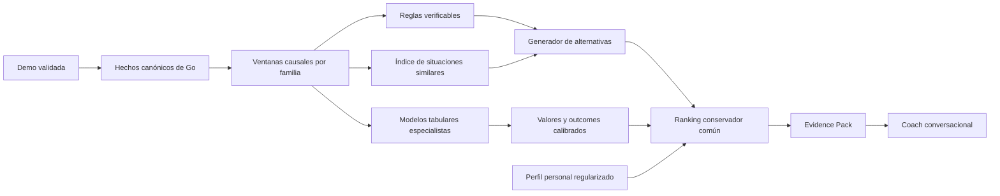

# Definición canónica del producto: AI Coach de CS2

| Campo | Valor |
|---|---|
| Estado | Canónico |
| Versión | 1.1 |
| Fecha | 27 de agosto de 2026 |
| Equipo objetivo | Dos personas |
| Restricción | Mínima inversión antes de validar el coach integral de Mirage |
| Documento de ejecución | [AI_COACH_IMPLEMENTATION_PLAN.md](./AI_COACH_IMPLEMENTATION_PLAN.md) |

## Cómo usar este documento

Este fichero define qué producto estamos construyendo, qué promete al usuario y qué límites debe respetar. Debe leerse antes del plan de implementación.

No contiene el backlog ni refleja el estado diario del desarrollo. Esas cuestiones pertenecen al documento de implementación. Si ambos documentos entran en conflicto, este documento decide el comportamiento del producto y el plan decide únicamente cómo construirlo.

Sustituye como fuente de verdad a:

- `AI_COACH_ARCHITECTURE.md`;
- `docs/AI_COACH_MASTER_PLAN.md`;
- `docs/AI_COACH_ML_DATA_AND_TRAINING_ARCHITECTURE.md`.

Los informes de auditoría y contratos de datos permanecen como evidencia técnica, pero no pueden ampliar por sí solos el alcance del producto.

---

## 1. Decisión de producto

StratAI será inicialmente un coach personalizado pospartida. Analizará una demo completa, localizará decisiones relevantes, identificará errores respaldados por evidencia y propondrá una acción mejor que estuviera disponible con la información razonable del jugador en ese momento.

No será un panel de estadísticas, un chatbot que improvise consejos ni un agente que intente jugar CS2. El producto deberá unir cuatro cosas:

1. una observación verificable de la demo;
2. una alternativa concreta y realizable;
3. una estimación comparativa de su valor;
4. una explicación adaptada al historial del jugador.

El usuario debe sentir que el coach ha visto su partida y comprende sus hábitos, no que está recitando reglas genéricas.

El producto tendrá dos flujos distintos que compartirán exactamente el mismo contrato canónico de Go:

1. **Demos FACEIT para aprendizaje:** no tienen un jugador principal por defecto; sirven para construir datasets, referencias y modelos globales.
2. **Demos del usuario para coaching:** tienen un jugador principal identificado de forma segura; sirven para aplicar los modelos, construir su perfil y generar recomendaciones.

Las demos del usuario no entrarán automáticamente en el entrenamiento global. Su reutilización exigirá consentimiento, anonimización, controles de calidad, versionado y posibilidad de retirada.

La versión 1.1 distingue dos entregas que antes se confundían:

- el **vertical técnico inicial**, limitado a dos familias para demostrar que la cadena completa funciona;
- el **coach integral de Mirage**, que será la primera versión que podrá presentarse como coach completo.

Diseñar el vertical primero no reduce el alcance final. El catálogo completo de capacidades y sus necesidades de datos se cerrará antes de entrenar o ampliar el corpus.

---

## 2. Promesa central

> **No hay error sin una acción mejor respaldada.**

Si el sistema no puede identificar una alternativa disponible con un valor esperado superior, no puede presentar la acción observada como un error. Podrá describir el evento, señalar riesgo o pedir más contexto, pero deberá abstenerse de corregirlo.

Toda corrección prescriptiva responderá:

1. ¿Qué hizo el jugador?
2. ¿Qué muestra el proxy como observable o razonablemente inferible en `T0`?
3. ¿Qué alternativas eran físicamente y tácticamente posibles?
4. ¿Cuál es la mejor alternativa estimada?
5. ¿Dónde y cuándo debía ejecutarse?
6. ¿Por qué tiene más valor esperado?
7. ¿Qué diferencia estimada existe?
8. ¿Qué evidencia y situaciones comparables la respaldan?
9. ¿Con qué confianza se afirma?
10. ¿Qué información haría cambiar la recomendación?

Una observación sin alternativa accionable no ocupará uno de los hallazgos principales de la partida.

El producto no puede reconstruir la mente, la atención ni la comunicación del jugador. Usará un `observable_proxy`: visión reconstruida, información de objetivo, estados propios y aliados, contactos previos y demás hechos cuya disponibilidad pueda probarse. Sonido, voz e intención quedan fuera. La redacción dirá «información disponible según la demo» y no «sabías» cuando no exista evidencia de conocimiento subjetivo.

---

## 3. Qué significa «la mejor jugada»

La mejor jugada no es la acción perfecta reconstruida después de conocer la posición real de todos los enemigos. Es la acción con mayor valor esperado entre las alternativas respaldadas, dadas:

- la información observable o razonablemente inferible en `T0`;
- la geometría y el tiempo disponible;
- el inventario y la economía;
- la posición y capacidad de apoyo de los compañeros;
- el nivel de incertidumbre;
- la capacidad de ejecución estimada del jugador;
- la cobertura existente en los datos.

En estos documentos, «causal» significa que la información era legal en `T0` y que no existe fuga de futuro. No significa que una demo observacional demuestre por sí sola qué habría ocurrido al intervenir y elegir otra acción. El valor será inicialmente una estimación condicional respaldada por soporte, overlap, reglas y revisión humana; nunca se presentará como un futuro alternativo observado.

La selección se formaliza como:

$$
a^* = \arg\max_{a \in A_{soportadas}(s)}
\left[V(s,a,p)-\lambda_u U(s,a)-\lambda_o OOD(s,a)\right]
$$

Donde:

- `s` es el estado observable o belief state en `T0`;
- `a` es una acción candidata viable;
- `p` es el perfil de ejecución del jugador;
- `V` es el valor esperado;
- `U` es la incertidumbre;
- `OOD` penaliza acciones fuera del soporte del dataset.

### 3.1 Tres resultados posibles

El recomendador podrá concluir:

1. **Una acción claramente superior:** se ofrece como recomendación principal.
2. **Dos o más acciones equivalentes:** se presentan como opciones condicionadas; no se inventa un ganador.
3. **Cobertura insuficiente:** el sistema se abstiene de llamar error a la acción.

### 3.2 Recomendaciones condicionales

La táctica no siempre es una orden cerrada. El coach podrá producir políticas sencillas:

> Mantén la posición mientras no haya contacto en B. Si se confirman al menos dos rivales, rota por spawn. Si solo aparece una utilidad, conserva el control de tu zona.

### 3.3 Personalización de la acción óptima

Una jugada de alto valor para un profesional puede no ser la de mayor valor para otro jugador. El coach ajustará el ranking por:

- probabilidad personal de ganar ese tipo de duelo;
- arma y situación;
- consistencia mecánica;
- rutas y posiciones dominadas;
- uso de utilidad;
- errores de ejecución recurrentes.

La recomendación debe ser ambiciosa pero ejecutable para la persona que la recibe.

---

## 4. Resultado esperado para el usuario

Después de procesar una partida, el producto mostrará como máximo tres correcciones prioritarias, hasta dos acciones positivas cuando estén respaldadas y un patrón longitudinal cuando haya suficiente historial.

Cada corrección incluirá:

- ronda y momento exacto;
- acción observada;
- mejor acción estimada;
- lugar, timing y condición de ejecución;
- diferencia de valor o categoría comparativa;
- separación entre decisión y ejecución;
- clip, replay o eventos de evidencia;
- recurrencia personal;
- confianza y limitaciones;
- regla práctica o ejercicio.

Ejemplo de salida objetivo:

> **Entrada sin conexión en connector, ronda 18.** La flash del compañero ya estaba en vuelo y era observable en `T0`; la mejor alternativa estimada era esperar entre uno y dos segundos para entrar con ella. El peek inmediato te exponía a dos ángulos y dejaba el trade a más de tres segundos. Aunque ganaste el primer duelo, la decisión tenía menor valor esperado. Este patrón aparece seis veces en tus últimas ocho partidas de Mirage. Confianza media-alta.

---

## 5. Cobertura integral y orden de incorporación

StratAI debe llegar a valorar todas las áreas relevantes que una demo permita observar con seguridad. El alcance se diseña completo desde el principio, aunque sus especialistas se construyan y validen por etapas.

«Valorar todo» no significa inventar lo que la demo no contiene. Significa cubrir todo lo observable, indicar la confianza y abstenerse en lo que dependa de intención, voz, atención mental, entrada exacta de teclado o ratón, sonido subjetivo o futuros que no ocurrieron.

| Entrega | Propósito | Cuándo termina |
|---|---|---|
| Contrato integral | Definir todas las capacidades, decisiones, acciones, datos, límites y modelos | Cada familia tiene contrato y matriz de datos, aunque todavía no esté implementada |
| Vertical técnico inicial | Probar la cadena completa en Mirage con trade/spacing y peek/hold/reposición | Pasa sus gates causal, espacial, de alternativas y revisión humana |
| Coach integral de Mirage | Cubrir el núcleo completo de coaching observable en Mirage | Todas las familias activas pasan su gate propio y se integran en un único informe |
| Expansión multimapa | Repetir geometría, zonas, corpus y evaluación por mapa | Cada mapa supera su gate antes de publicar recomendaciones |

El vertical técnico es una prueba interna de arquitectura. No define por sí solo el producto terminado.

### 5.1 Combate y mecánica observable

- Colocación de la mira y preparación del ángulo.
- Movimiento al disparar, parada y estabilidad medible.
- Primer disparo, ráfaga, spray, recarga y cambio de arma.
- Selección de objetivo y adaptación después del contacto.
- Separación entre una mala elección de duelo y una ejecución deficiente.

Las afirmaciones se adaptarán a la resolución real de la demo. No se publicarán milisegundos, teclas o movimientos de ratón que el contrato no pueda demostrar.

### 5.2 Peeks, duelos, cobertura y exposición

- Hacer peek, mantener, repetir, cambiar de ángulo o retirarse.
- Anchura del peek y exposición simultánea a varios ángulos.
- Uso de cobertura, posiciones previsibles y rutas de salida.
- Relación entre arma, distancia, vida, utilidad y riesgo del duelo.
- Reposicionamiento después de revelar información.

### 5.3 Juego en equipo, spacing, trade e impacto

- Entrar sin conexión real de trade.
- Romper el espaciado o llegar tarde al apoyo.
- Crossfires, dobles peeks y sincronización observable.
- Distinguir una entrada útil de una muerte sin consecuencias.
- Valorar kill, trade, espacio, objetivo y supervivencia después del contacto.
- Recomendar esperar, apoyar, reagruparse, avanzar o retroceder.

La existencia de un compañero vivo no equivale por sí sola a capacidad de trade. Deben considerarse distancia, tiempo, geometría, orientación y obstáculos.

### 5.4 Utilidad

- Elegir entre usar, retrasar, conservar o coordinar una utilidad.
- Flashes que ayudan, llegan tarde, ciegan al equipo o no tienen continuación.
- Smokes, molotovs y granadas según trayectoria, zona, timing y efecto observable.
- Morir con utilidad relevante sin usar.
- Facilitar una entrada, cruce, plantado, postplant o retake.

Se juzgarán hechos y consecuencias observables, no la intención real del lanzamiento.

### 5.5 Economía y conservación de recursos

- Comprar, hacer compra parcial, eco, force o save.
- Coherencia entre la compra individual y la del equipo.
- Drops, protección de armas y valor perdido.
- Consecuencias sobre rondas posteriores.
- Elección de arma y utilidad según rol, dinero y situación.

El objetivo será estimar valor esperado de ronda y partido, no aplicar una etiqueta rígida de «compra correcta».

### 5.6 Información disponible y respuesta

- Qué amenazas eran visibles o razonablemente inferibles en `T0`.
- Contactos anteriores, última posición conocida y antigüedad de la información.
- Reacción a información observable del objetivo y de los compañeros.
- Ignorar una amenaza disponible según el proxy o reaccionar a información todavía no disponible.

Voz, intención y experiencia auditiva subjetiva quedan fuera mientras no exista un contrato fiable. La redacción hablará de «información disponible según la demo», no de lo que el jugador pensaba o sabía.

### 5.7 Rotaciones y control del mapa

- Rotar demasiado pronto, demasiado tarde o por una ruta insegura.
- Abandonar, recuperar o duplicar innecesariamente una zona.
- Sobre-rotaciones y tiempos de llegada.
- Relación entre información disponible, control aliado, bomba y distribución del equipo.
- Mantener, ceder, recuperar o intercambiar espacio.

Las zonas, conexiones y rutas son clasificaciones propias de StratAI construidas sobre geometría y navegación; no se asumirán como hechos directos de demoinfocs.

### 5.8 Bomba, objetivos y gestión del tiempo

- Transporte, caída y recuperación de la bomba.
- Momento y lugar de plantado.
- Protección del plantado y estructura de postplant.
- Retake, intento de defuse o save.
- Uso del tiempo, kit, utilidad, distancias y rutas alcanzables.
- Abandono correcto de un objetivo que ya no es recuperable.

### 5.9 Ventaja, riesgo y situaciones especiales

- Conservación o pérdida de una ventaja numérica.
- Riesgo innecesario o pasividad perjudicial.
- Decisiones de clutch y situaciones de inferioridad.
- Priorización entre supervivencia, daño, espacio, objetivo y economía.
- Acción positiva aunque la ronda se pierda y acción débil aunque la ronda se gane.

La victoria de ronda es una señal importante, pero nunca la única definición de una buena decisión.

### 5.10 Evolución del jugador

- Errores y fortalezas repetidos por mapa, lado, zona, arma y fase.
- Diferencias entre decisión y ejecución.
- Tendencias recientes y comparación con jugadores de contexto similar.
- Prioridades de entrenamiento y ejercicios concretos.
- Mejora o empeoramiento posterior a una recomendación.

Esta capacidad es transversal: usa únicamente partidas anteriores a la recomendación evaluada y se contrae hacia el baseline global cuando hay poco historial.

---

## 6. Separación entre decisión y ejecución

Toda situación tendrá dos evaluaciones independientes.

### Valor de decisión

Se calcula antes de observar el resultado mecánico e incluye:

- información disponible;
- posición y timing;
- apoyo y tradeability;
- economía e inventario;
- alternativas viables;
- probabilidad de consecuencias favorables.

### Calidad de ejecución

Evalúa cómo se llevó a cabo la acción:

- movimiento;
- crosshair;
- reacción;
- precisión y spray;
- uso de utilidad;
- adaptación después del contacto.

Esto permite cuatro conclusiones:

| Decisión | Ejecución | Interpretación |
|---|---|---|
| Buena | Buena | Acción repetible que debe reforzarse |
| Buena | Mala | Idea correcta; hay que entrenar la ejecución |
| Mala | Buena | Resultado positivo no repetible; no reforzar el hábito |
| Mala | Mala | Prioridad alta de corrección |

---

## 7. Contrato mínimo de una recomendación

Cada recomendación existirá primero como un objeto verificable, antes de redactarse en lenguaje natural.

```text
recommendation_id
player_id_pseudonymous
match_id / round_id / t0
decision_type
task_eligibility
observable_state_ref
belief_state_ref
observed_action
candidate_actions[]
recommended_action
where
when
execution_conditions[]
value_taken
value_recommended
estimated_value_delta
comparison_basis
counterfactual_status
uncertainty
abstention_reason
support_count
support_band
effective_sample_size
similar_case_ids[]
evidence_ids[]
decision_score
execution_score
personal_pattern_ref
limitations[]
model_and_contract_versions
```

`comparison_basis` distinguirá como mínimo `verified_dominance_rule`, `observational_value_model`, `human_review_supported` y `ope_supported`. `counterfactual_status` dejará claro que una alternativa es estimada y no observada.

Una corrección solo es publicable si:

- la acción recomendada era viable en `T0`;
- no depende de información futura u oracle;
- tiene evidencia trazable;
- supera el margen mínimo frente a la acción observada;
- está dentro del soporte aceptado;
- su confianza supera el umbral del tipo de decisión.

---

## 8. Personalización

No se entrenará un modelo neuronal diferente para cada jugador. El coach integral combinará modelos globales especialistas con un perfil estadístico regularizado.

El perfil almacenará desviaciones contextuales respecto a jugadores comparables:

- mapa, lado y zona;
- arma y economía;
- fase de ronda;
- acompañado o aislado;
- tipo de duelo;
- acción elegida;
- decisión y ejecución;
- evolución reciente.

La estimación personal se contraerá hacia el baseline global cuando haya pocas muestras:

$$
perfil = \frac{n}{n+k}\cdot observadoPersonal + \frac{k}{n+k}\cdot baselineGlobal
$$

### Madurez del perfil

| Historial | Comportamiento del coach |
|---|---|
| 1-4 partidas | Predominan los modelos globales; no se afirman hábitos estables |
| 5-14 partidas | Primeros patrones personales con incertidumbre visible |
| 15-30 partidas | Perfil contextual útil y comparación temporal |
| Más de 30 | Posible embedding ligero si demuestra mejora sobre el baseline |

La personalización no consistirá en mencionar el nombre del usuario. Consistirá en cambiar el diagnóstico, la prioridad y la alternativa según su historial y capacidad.

---

## 9. Coach conversacional

El usuario podrá conversar de forma natural sobre una ronda, una recomendación o su evolución.

Preguntas objetivo:

- «¿Por qué dices que esta entrada fue mala?»
- «Pero conseguí matar al primero, ¿no compensó?»
- «¿Qué tenía que hacer exactamente?»
- «¿Por qué mantener era mejor que rotar?»
- «¿Me ocurre habitualmente?»
- «Enséñame tres casos similares.»
- «¿Qué debería entrenar esta semana?»
- «¿Está mejorando este problema?»

### 9.1 Arquitectura del diálogo

El LLM no analizará directamente demos o JSON crudo. Consultará herramientas internas:

```text
get_match_summary
get_round_state
get_recommendation
get_evidence_window
find_similar_situations
compare_player_baseline
get_player_trend
explain_metric
```

El LLM recibirá hechos, alternativas, confianza y limitaciones ya calculadas. Su función será:

- explicar;
- responder preguntas de seguimiento;
- adaptar profundidad y tono;
- convertir recomendaciones en ejercicios;
- reconocer contradicciones;
- abstenerse cuando falte evidencia.

### 9.2 Dos clases de conversación

1. **Sobre las partidas del usuario:** siempre respaldada por herramientas y evidencia.
2. **Sobre conocimiento general de CS2:** identificada como orientación general, no como conclusión extraída de la demo.

La memoria conversacional y el perfil táctico serán stores separados. El usuario podrá borrar ambos.

---

## 10. Arquitectura lean del producto



### Componentes obligatorios

1. **Proveedores de hechos:** Go, geometría y observabilidad producen información legal en `T0`.
2. **Reglas verificables:** detectan hechos geométricos o contractuales claros.
3. **Especialistas prescriptivos:** trade, peek, mecánica, utilidad, economía, rotación y objetivo comparan acciones.
4. **Modelos tabulares especialistas:** CatBoost es candidato solo donde una familia prescriptiva necesite aprendizaje; una regla puede seguir siendo la solución promovida si funciona mejor.
5. **Evaluadores transversales:** ventaja, riesgo, tiempo y clutch combinan outcomes de varios especialistas.
6. **Recuperación de casos:** aporta alternativas reales y soporte.
7. **Generador de acciones:** propone pocas opciones válidas.
8. **Ranking conservador:** selecciona la mejor estimada o se abstiene.
9. **Perfil personal:** ajusta valor, prioridad y ejecución usando historia anterior.
10. **Evidence Pack:** contrato único entre análisis y lenguaje.
11. **LLM:** conversación y explicación, nunca fuente primaria del juicio.

### Tecnología prevista para la primera versión integral

- Parquet y DuckDB para datasets e investigación.
- Python para construcción de ventanas, modelos y evaluación.
- Reglas y promedios contextuales como baseline mínimo.
- Regresión logística o lineal regularizada como baseline aprendido.
- CatBoost como primera opción por familia para combinar números, categorías y ausencias en CPU.
- LightGBM o XGBoost únicamente como comparación cuando exista una razón medible.
- Modelos separados o cabezas separadas para los outcomes de cada familia; no una etiqueta opaca universal de «jugada correcta».
- Inferencia batch en CPU.
- Índice local de situaciones similares.
- Servicio FastAPI existente para exponer resultados.
- LLM externo bajo límites de coste para la conversación.

Un modelo temporal pequeño, como una TCN o GRU, solo se evaluará en familias donde el orden de los movimientos demuestre ser imprescindible. Un Transformer temporal compacto se estudiará después únicamente si esas opciones no bastan. Cualquier modelo temporal deberá superar al baseline tabular en un test congelado antes de incorporarse. No se usará deep learning por defecto.

---

## 11. Taxonomía de acciones objetivo

El espacio de acciones será pequeño y jerárquico. No se intentará representar cada movimiento de ratón.

El contrato integral definirá desde el principio todas las familias. El vertical técnico activará primero las acciones necesarias para trade/spacing y peek/hold/reposición. El coach integral de Mirage no estará terminado hasta activar el núcleo completo con un gate independiente por familia.

### Posicionamiento

- `hold_position`
- `delay_action`
- `advance_to_zone`
- `fall_back_to_zone`
- `reposition_within_zone`
- `regroup_with_teammate`
- `support_teammate`

### Combate

- `take_duel`
- `avoid_duel`
- `hold_angle`
- `first_peek`
- `repeat_peek`
- `wide_peek`
- `jiggle_for_information`
- `change_angle`
- `stop_before_shooting`
- `continue_burst`
- `reset_spray`
- `reload_now`
- `delay_reload`
- `wait_for_trade_connection`

### Utilidad

- `use_utility_now`
- `delay_utility`
- `save_utility`
- `use_utility_for_zone`
- `use_utility_for_teammate`
- `use_utility_for_objective`

### Economía

- `full_buy`
- `partial_buy`
- `eco`
- `save_equipment`
- `drop_equipment`

### Información, rotación y control

- `hold_map_control`
- `take_map_control`
- `cede_map_control`
- `rotate_to_site`
- `delay_rotation`
- `cancel_rotation`
- `choose_safe_route`

### Objetivo y tiempo

- `attempt_objective`
- `abandon_objective`
- `plant_now`
- `delay_plant`
- `protect_planter`
- `hold_postplant`
- `start_retake`
- `attempt_defuse`
- `save_from_retake`

Las acciones concretas incluirán zona, ruta, timing y condiciones cuando los datos lo permitan. Una acción presente en la taxonomía no queda automáticamente autorizada para recomendarse: debe ser físicamente posible, estar soportada por datos comparables y superar el gate de su familia y mapa.

---

## 12. Alcance de las primeras entregas

### 12.1 Vertical técnico inicial

El vertical técnico debe demostrar en Mirage:

- cobertura prescriptiva de `spacing_or_trade_connection` y `peek_hold_or_reposition`;
- una alternativa viable y respaldada por cada corrección;
- evidencia navegable en replay;
- decisión y ejecución separadas;
- ranking, incertidumbre y abstención;
- un Evidence Pack que el lenguaje no pueda alterar.

Esta entrega valida la arquitectura de extremo a extremo. Puede utilizarse internamente y en pruebas controladas, pero no se presentará como el coach completo.

### 12.2 Coach integral de Mirage

La primera versión presentable como coach debe integrar, con profundidad proporcional a la evidencia disponible:

- combate y mecánica observable;
- peeks, duelos, posicionamiento, cobertura y exposición;
- spacing, trades, apoyo e impacto de entry;
- utilidad;
- economía;
- información disponible;
- rotaciones y control del mapa;
- bomba, postplant, retake, save y tiempo;
- gestión de ventaja, riesgo y clutch;
- patrones longitudinales del jugador.

Cada familia tendrá elegibilidad, dataset, modelo o regla, umbral de confianza, test humano y posibilidad de abstención propios. «Integral» significa que todas las áreas están representadas y que el sistema puede juzgarlas cuando hay evidencia; no significa que deba inventar un hallazgo en cada ronda.

La experiencia seguirá mostrando como máximo tres correcciones prioritarias y hasta dos acciones positivas por partida. El sistema reunirá especialistas distintos en un único informe sencillo.

### 12.3 Expansión a otros mapas

Mirage será el primer mapa completo. El pipeline puede procesar otros mapas para validar robustez, pero no publicará recomendaciones específicas hasta que cada combinación mapa-familia supere sus gates de geometría, zonas, datos, modelo y revisión humana.

---

## 13. Fuera de la primera versión integral

- Offline reinforcement learning.
- World model general de CS2.
- Transformer o GNN sobre partidas completas.
- Entrenamiento de un modelo por usuario.
- Coaching en tiempo real.
- Razonamiento fiable sobre voz e intención del equipo.
- Afirmaciones exactas sobre teclas, ratón, atención mental o sonido subjetivamente percibido.
- Simulación exacta de futuros.
- Recomendaciones fuera del soporte observado.
- Servidor GPU permanente.
- Entrenamiento o alojamiento de un LLM propio.
- Arquitectura Kubernetes o MLOps gestionado.
- Afirmaciones de optimalidad absoluta.

Estas posibilidades solo se revisarán si un baseline más sencillo demuestra una limitación medible y el producto ya tiene usuarios.

---

## 14. Reglas de comunicación

El coach deberá:

- hablar de acciones y evidencia, no de culpabilidad;
- distinguir hecho, derivación e inferencia;
- usar la información disponible en `T0` al valorar la decisión;
- poder usar el futuro únicamente para explicar consecuencias;
- indicar confianza;
- reconocer alternativas equivalentes;
- reconocer cuando no sabe;
- corregirse si una pregunta revela una evidencia omitida;
- evitar precisión falsa;
- convertir cada recomendación en una conducta entrenable.

No podrá afirmar:

- intención del jugador o del equipo sin evidencia;
- conocimiento de un enemigo oculto;
- causalidad a partir de una correlación aislada;
- que una acción fue errónea solo porque la ronda se perdió;
- que una acción fue correcta solo porque produjo una kill.

---

## 15. Métricas de éxito del producto

Antes de ampliar la arquitectura, el coach integral de Mirage debe alcanzar objetivos acordados en un piloto. Los umbrales de promoción se versionarán antes de abrir el test y no se ajustarán después de ver sus resultados. Se medirán al menos:

- porcentaje de correcciones aceptadas como correctas por revisión humana;
- porcentaje considerado útil y accionable;
- fidelidad entre explicación y evidencia;
- porcentaje de errores que incluyen alternativa viable;
- cobertura de partidas con al menos un hallazgo de confianza alta;
- tasa de abstención correcta;
- tasa de alternativas fuera de distribución;
- recurrencias personales confirmadas;
- uso de preguntas de seguimiento;
- cambio del patrón en partidas posteriores;
- coste y latencia por partida.

La prioridad será precisión sobre cobertura. Cero hallazgos es preferible a un consejo falso.

---

## 16. Restricciones de equipo y presupuesto

Decisiones vigentes:

- Dos personas deben poder comprender y mantener todo el sistema.
- No se compra una GPU para la primera versión integral.
- El entrenamiento inicial debe funcionar en CPU local.
- El gasto externo acumulado antes del piloto tendrá un límite de 1.000 EUR.
- El primer mes debe poder ejecutarse con un gasto de 0-100 EUR.
- Cada servicio adicional necesita una razón medible y un límite de coste.
- El dinero se prioriza para datos válidos y evaluación humana, no para modelos grandes.

El recurso escaso es el tiempo de desarrollo. Toda complejidad debe justificar una mejora medible sobre el baseline.

---

## 17. Decisiones no negociables de la primera versión integral

1. No hay error sin una alternativa mejor respaldada.
2. La recomendación usa información legal en `T0`.
3. Oracle y estado observable permanecen separados.
4. El LLM no decide qué acción era mejor.
5. El ranking penaliza incertidumbre y acciones OOD.
6. Decisión y ejecución se evalúan por separado.
7. La personalización empieza con regularización, no con fine-tuning por jugador.
8. El catálogo integral de capacidades, datos y límites se define antes de entrenar o ampliar el corpus.
9. Cada familia tiene contrato, elegibilidad, modelo, métricas y gate propios.
10. Se comparan reglas y modelos tabulares especialistas antes de usar deep learning.
11. FACEIT se usa como factoría offline de datos, no como dependencia del runtime web.
12. Las demos del usuario y las de entrenamiento comparten extractor, pero no finalidad ni consentimiento.
13. Demos, datasets y modelos no se versionan en Git.
14. El producto puede abstenerse.
15. Cada claim debe ser trazable a evidencia y versión.

---

## 18. Cuándo revisar esta definición

Solo se revisará el alcance si ocurre alguno de estos eventos:

- el coach integral no puede producir alternativas útiles con el espacio de acciones actual;
- el baseline tabular alcanza un techo demostrado;
- el corpus supera el volumen y diversidad definidos en el plan;
- el piloto valida demanda de una capacidad fuera de alcance;
- cambia de forma material el acceso a demos o el contrato de datos;
- se amplía el equipo o el presupuesto.

Una nueva técnica no constituye por sí sola una razón para ampliar la arquitectura.

---

## 19. Definiciones de terminado

### 19.1 Vertical técnico

El vertical técnico estará terminado cuando las dos primeras familias puedan:

1. reconstruir una decisión causal de Mirage;
2. comparar la acción observada con alternativas físicamente válidas;
3. separar decisión y ejecución;
4. abrir la evidencia correcta en el replay;
5. calibrar incertidumbre y abstenerse;
6. superar sus benchmarks y revisión humana congelados.

Este resultado demuestra que la arquitectura funciona. No autoriza a describir StratAI como coach integral.

### 19.2 Coach integral de Mirage

La primera versión del producto estará terminada cuando un usuario pueda:

1. procesar una partida compatible de Mirage;
2. recibir una valoración conjunta de todas las familias enumeradas en la sección 5;
3. recibir hasta tres correcciones priorizadas y hasta dos acciones positivas respaldadas;
4. ver la acción observada y la mejor alternativa estimada cuando exista;
5. comprobar el momento y los hechos en el replay;
6. distinguir decisión de ejecución;
7. entender confianza, soporte y limitaciones;
8. preguntar y repreguntar al coach sin que el LLM invente el juicio;
9. consultar patrones construidos solo con su pasado;
10. obtener un plan de mejora adaptado;
11. ver una abstención clara cuando la demo o los datos no permiten juzgar;
12. recibir recomendaciones solo de familias que hayan superado su gate propio.

Todas las familias deben estar representadas. Una familia puede abstenerse en un caso concreto, pero no puede omitirse del producto porque nunca se diseñó, midió o evaluó.

Ese resultado, y no la complejidad de los modelos, define el éxito de la primera versión integral.
